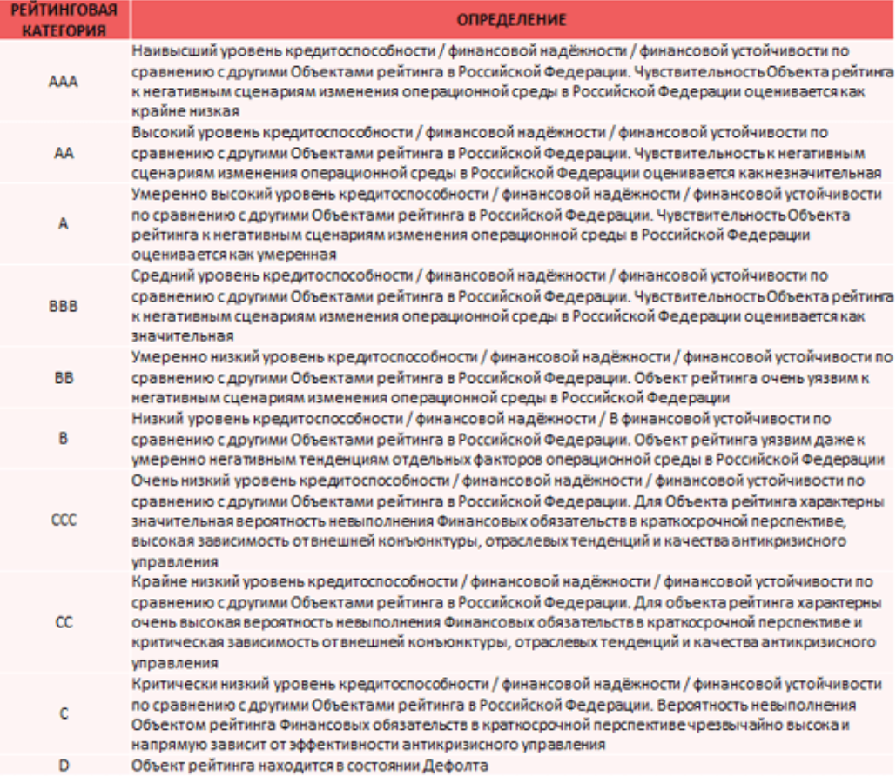
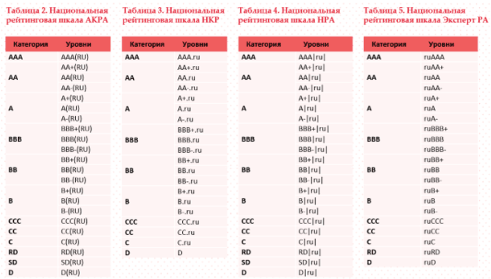

**Ценные бумаги** - это документы, которые дают своим владельцам определенные имущественные и неимущественные права.

---
### Инструменты финансового рынка

1. **Ценные бумаги**
	1. Долевые
		1. *Акции*
		2. *Паи инвестиционных фондов*
	2. Долговые
		1. *Облигации*
		2. *Векселя*

> **Основные ценные бумаги** подразумевают имущественные права на какой-то актив: деньги, ресурсы, капитал и т.п.
> **Долевые** - подтверждают право собственности инвестора на акционный капитал компании или его часть.
> **Долговые** - удостоверяют, что инвестор дал компании деньги в долг на определенных условиях.

3. **Производственные финансовые инструменты**
	1. Фьючерсы
	2. Опционы

>Стоимость **производственных ценных бумаг** зависит от цены базового биржевого актива, который находится в основе этого инструмента. Обычно такие инструменты торгуются на срочном рынке.

---

### Классификация типов ценных бумаг

1. **По сроку обращения**
	1. Срочные - срок обращения ограничен (облигации, еврооблигации)
	2. Бессрочные - срок обращения неограничен (акции, ETF, БПИФы)
2. **По фиксации владельца**
	1. Именные бумаги - данные владельца вносятся в специальный реестр. Только этот человек может претендовать на имущество. Чтобы ее продать нужна *идентификация* ее владельца.
	2. Предъявительские бумаги - свободно обращаются и принадлежат юридическим лицам. Сам факт *предъявления* подтверждает право на ее собственность
3. **По форме выпуска**
	1. Эмиссионные - выпускаются большими объемами (акции, облигации, паи фондов и т.п.)
	2. Неэмиссионные - выпускаются штучно или небольшими объемами (чеки, векселя и т.д.)
4. **По форме существования**
	1. Документарные - ценные бумаги, которые можно потрогать
	2. Бездокументарные - в депозитарии или реестре фиксируются данные владельца, а ему выдают документ о праве собственности на ценную бумагу

---

### Что еще нужно знать о ценных бумагах

**ISIN** **(international Securities Identification Numbers)** - Международный идентификационный код ценной бумаги. Он состоит из 12 букв и цифр. Служит для определения финансовых инструментов. Создан для быстрого поиска ценных бумаг, чтобы не возникало путаницы. Данный номер уникальный для каждой ценной бумаги по всему миру.

>**ISIN** ценным бумагам присваивают национальные нумерующие агенства (ННА) по всему миру. В России этим занимается НРД (Национальный расчетный депозитарий).

**Пример:** RU0009029540
- Первые два символа указывают на страну происхождения ценной бумаги.
- Символы 3-11 являются национальным идентификационным кодом ценной бумаги (NSIN), который присваивается агентством.
- Последний символ рассчитывают по предыдущим 11 цифрам и буквам. Он подтверждает подлинность кода и защищает от его подделки.

---

### Листинг и котировальные списки

Ценные бумаги появляются на бирже в несколько этапов. Один из таких этапов - **листинг**.

В ходе **листинга** биржа изучает документы, представленные эмитентом и решает - допускать ли ценную бумагу к торгам.

Список ценных бумаг, допущенных к торгам состоит из двух частей:
1. Котировальная часть
	- Первый уровень
	- Второй уровень
2. Некотировальная часть
	- Третий уровень

> Есть общие требования, выполнения которых необходимо для включения в любой уровень списка. Также есть дополнительные требования для попадания в котировальную часть списка. 
> Все требования можно найти на сайте Мосбиржи.
> Сложнее всего попасть в первые два уровня списка, считается, что чем выше уровень, тем надежнее инструмент.
>
>Если ценная бумага не включена в котировальную часть - это не значит, что она ненадежная или плохая. Для попадания в эту часть компаниям нужно тратить больше времени и денег. Иногда эмитенты просто предпочитают сэкономить на затратах, но остаться в некотировальной части.

---

### Для чего нужны тикеры

До цифровизации информацию с биржи передавали с помощью телеграфа. Названия компаний приходилось сокращать до нескольких букв. так они превратились в буквенные коды - **тикеры**.

**Пример:** SBER - Сбербанк

>В конце некоторых тикеров можно увидеть дополнительный буквы. Часто это буква Р, которая обозначает привилегированные акции.
>
>*Тикеры не являются международными. И для одной компании на разных биржах могут не совпадать.*

---

### Лоты

**Лот** - минимальное количество ценных бумаг, которое может купить или продать инвестор за одну сделку.

> Так как ценные бумаги на бирже продаются лотами. Количество ценных бумаг в одном стандартном лоте можно увидеть на сайте Мосбиржи или непосредственно при покупке у брокера.

---

### Кредитный рейтинг

Инвесторам сложно сориентироваться в огромном количестве эмитентов. Не всегда понятно, надежная ли это компания.
Способность и возможность эмитента выполнять финансовые обязательства показывает **кредитный рейтинг**, который составляется **рейтинговыми агентствами**.
Кредитный рейтинг учитывает финансовое положение компании, размер ее долга, объем активов и капитала.

Чаще всего кредитные рейтинги присваивают:
- Государствам
- Регионам
- Компаниям
- Отдельным выпускам ценных бумаг

Кредитные агентства могут быть:
- Международные агентства - Fitch, Moodys, S&P и др.
- Национальными - В России - АКРА, Эксперт РА, НКР, НРА.

>Единой шкалы для оценки нет. В агентствах используют свои шкалы.

---
