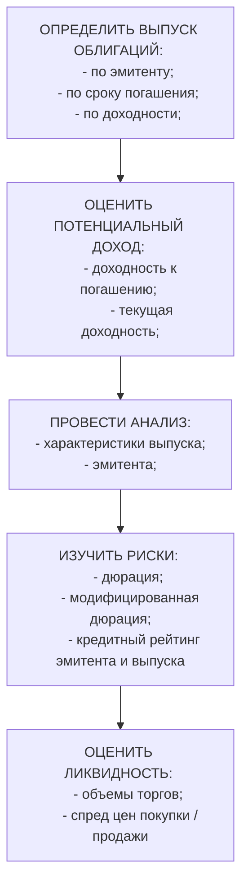

Выбрать облигации также помогают сайты-скринеры. При поиске инвестор задаёт конкретные требования к выпуску и выбирает между предложенных.
### Как выбрать облигации

---
### На что обратить внимание при выборе облигации

#### Надежность эмитента

Обязательно проанализировать кредитную нагрузку и платежеспособность. В этом инвестору поможет фундаментальный анализ. Не стоит забывать, что облигации с большими рисками обычно дают более высокую доходность.

Важно обратить внимание на кредитный рейтинг эмитента и выпуска облигаций. Однако он не должен быть единственным параметром для оценки эмитента.
#### Характеристики выпуска

Описание выпуска формируется еще на этапе эмиссии облигаций. Инвестор до покупки облигаций должен изучить:

- Номинал облигации;
- Срок обращения;
- Ставку купона;
- Тип купона;
- Наличие оферты;
- Наличие амортизации;
#### График выплат купонов

Выплата купонов по облигациям строго распланирована еще на этапе выпуска. Изучение графика выплат сориентирует инвестора в датах получения процентных выплат. И поможет продумать реинвестирование купонов или траты полученного дохода.
#### Доходность облигаций

Один из важнейших параметров отбора. Доходность к погашению важна для инвесторов, которые планируют держать облигации до погашения. Если инвестор планирует продавать ценные бумаги до их погашения можно рассмотреть и текущую доходность выпуска.
#### Дюрация

Дюрация поможет оценить возможность изменения цены облигации и скорость возврата вложенных средств. Этот параметр важен для инвесторов, которые планируют продавать облигации до срока их погашения. Так же и для тех, кто будет держать выпуск до полного возврата долга.
#### Ликвидность

Низколиквидные облигации сложно купить и продать. Оценить ликвидность можно по обороту выпуска за день. Чем выше оборот, тем выше ликвидность. Однако в разные дни обороты отличаются, поэтому анализировать лучше длительные периоды - месяц или квартал.

После составления списка интересных инвестору выпусков, можно переходить непосредственно к покупке облигаций.

>**Важно!** У некоторых брокеров ограниченный список доступных облигаций. На этапе отбора ценных бумаг нужно проверить, есть ли она в доступных для покупки.

---
### Как купить облигации

Облигации, как и акции, покупаются через брокеров. Для покупки облигаций инвестору нужно пополнить брокерский счет и знать, какие ценные бумаги он будет покупать.

Как и в случае с акциями **выставить заявку** можно несколькими способами:

- По звонку брокеру;
- Через торговый терминал;
- Через личный кабинет брокера;
- Через мобильное приложение брокера;

При небольшом количестве продавцов инвестор может столкнуться с большим разбросом цен предложений. Поэтому покупать облигации целесообразнее через **лимитные заявки**. Так инвестор защитит себя от покупки по невыгодной цене.

