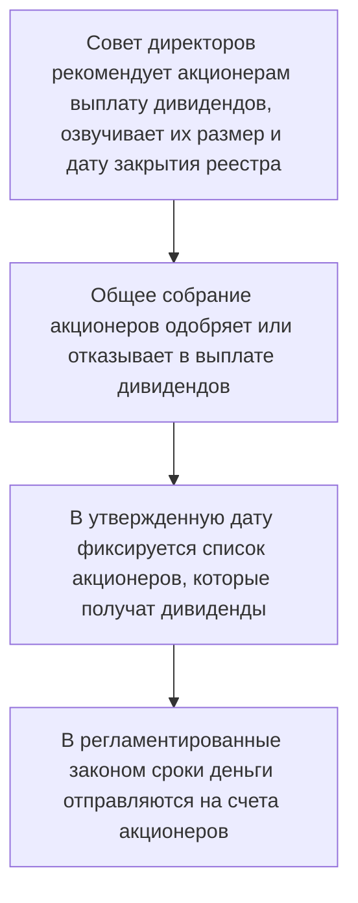

**Акция** - эмиссионная ценная бумага, которая закрепляет права ее владельца на участие в управлении компанией. А также на получение части прибыли компании в виде дивидендов и части имущества после ее ликвидации.

---

### Почему компании выпускают акции

Компании размещают акции на бирже для привлечения денег. Первичное размещение акций на бирже называется **IPO (Initial Public Offering)**. Оно позволяет владельцам компании привлечь дешевый капитал и поднять статус компании.

>Эмитент не гарантирует выплату дивидендов, и не обязан возвращать инвесторам деньги, которые они вложили в покупку акций.

---

### Классификация акций

1. **По типу акционерного общества**
	- *Акции публичных компаний* - выпускаются в форме открытой и закрытой эмиссии. Открытая - может купить любой желающий, закрытая - предлагаются ограниченному кругу лиц.
	- *Акции непубличных компаний* - выпускаются только в форме закрытой эмиссии. Действующие акционеры имеют преимущества для покупки.
2. **По выпуску и обращению**
	- *Размещенные акции* - акции, которые уже куплены инвесторами
	- *Объявленные акции* - акции, которые могут быть выпущены эмитентом в дополнение к уже имеющимся.
3. **По объему прав**
	- *Обыкновенные* - владельцы имеют право: голосовать, передать акции другому инвестору, получить часть прибыли компании в виде дивидендов, получать часть имущества при ее ликвидации, преимущественное право на покупку дополнительных выпусков акций.
	- *Привилегированные* - получение фиксированного дивиденда, голосовать только в определенных случаях, приоритетное право на получение доли имущества.
4. **По возможности участия в голосовании**
	- *Голосующие обыкновенные акции* - дают права голосовать на собрании акционеров
	- *Неголосующие обыкновенные акции* - не дают права голосовать на собрании акционеров
	- *Акции с ограниченным правом голоса* - дают возможность голосовать владельцу при определенном количестве ценных бумаг
	- *Подчиненные обыкновенные акции* - дают меньший вес голоса, чем другие обыкновенные акции

>По закону компания не может размещать привилегированные акции номинальной стоимостью ниже номинальной стоимости обыкновенных акций.
>Общая номинальная стоимость всех размещенных привилегированных акций компании **не должна быть больше 25%** ее уставного капитала.

Разделение привилегированных акций:
1. **По условиям обращения**
	- *Конвертируемые привилегированные акции* - дают право обменять акции в течение конкретного периода времени на другие ценные бумаги
	- *Отзывные и возвратные привилегированные акции* - могут быть погашены эмитентом в период существования компании
2. **По возможному дивиденду**
	- *С фиксированным дивидендом*
	- *С регулируемой ставкой дивиденда* - часто привязывается к другой процентной ставке
	- *С аукционной ставкой дивиденда* - размер дивиденда определяется в ходе аукциона
	- *С дополнительным дивидендом* - по акциям есть минимальный порог дивиденда, который компания обязана выплачивать
3. **По возможности накопления невыплаченных дивидендов**
	- *Кумулятивные привилегированные акции* - копят невыплаченные или выплаченные частично дивиденды определенное время
	- *Некумулятивные привилегированные акции* - невыплаченные или выплаченные частично дивиденды не копятся

>Какие дополнительные права дают акции своему владельцу:
>**1%** - Ознакомиться с информацией из реестра акционеров компании. Подать в суд на Совет директоров, если компания понесла убытки по его вине.
>**2%** - Выдвинуть кандидатов в Совет Директоров. Внести предложения для обсуждения на очередном собрании акционеров.
>**10%** - Ознакомиться со списком участников общего собрания акционеров. Требовать созыва внеочередного общего собрания акционеров. Требовать внеочередной проверки или ревизии компании.
>**25% + 1** - Инвестор может заблокировать решение общего собрания акционеров, касающееся вопросов изменения Устава компании, ее реорганизации, ликвидации, совершения крупных сделок по отчуждению имущества.
>**50% + 1** - Контрольный пакет, который дает возможность проводить общее собрание акционеров и принимать решения кроме совершения крупных сделок, изменений в Уставе, реорганизации и ликвидации компании.
>**75% + 1** - Абсолютный пакет, который подразумевает полный контроль над деятельностью компании.
>
> Все акции в Российской Федерации **именные**.

---

### Разные стоимости акций

- **Номинальная** - показывает, сколько уставного капитала приходится на одну акцию. При сложении номинальной стоимости всех акций компании получится размер уставного капитала.

>Выставляя ценную бумагу на торги, акционерное общество не может установить на нее цену ниже номинальной

- **Эмиссионная** - на **IPO** покупатель приобретает акцию на бирже именно по эмиссионной стоимости. 

>Разница между эмиссионной и номинальной стоимостью называется *эмиссионным доходом*

- **Рыночная** - Реальная стоимость акции на бирже.

>Отражает отношение к компании инвесторов: популярность компании, ликвидность баланса, спроса и предложения

- **Балансовая** - ее можно получить делением балансовой стоимости компании на количество выпущенных акций.

---

### Депозитарные расписки

В некоторых странах законы запрещают компаниям продавать свои акции на иностранных биржах. В этом случае прибегают к **депозитарным распискам**. 

**Депозитарная расписка** - это вторичная ценная бумага, которая дает право собственности на другую ценную бумагу. То есть это *сертификат*, который подтверждает право владельца на ценные бумаги иностранных эмитентов. 

>При необходимости депозитарные расписки могут быть конвертированы в акции.
#### Процесс появления депозитарных расписок
1. Компания размещает в стране А акции в банке-кастодиане. Он хранит и управляет активами клиентов.
2. Банк-кастодиан направляет информацию о размещенных в нем акциях в банк-депозитарий из страны Б.
3. Банк-депозитарий из страны Б выкупает акции или их часть, но бумаги продолжают храниться в кастодиане.
4. На бирже страны Б банк-депозитарий выпускает депозитарные расписки, которые могут купить инвесторы. ДР будут подтверждать, что инвестор владеет акциями, которые хранятся в банке-кастодиане страны А.
#### Виды депозитарных расписок
В зависимости от эмитента страны выделяют:
1. Американские депозитарные расписки (ADR)
2. Европейские депозитарные расписки (EDR)
3. Глобальные депозитарные расписки (GDR) - выпускаются разными банками мира и торгуются в нескольких странах одновременно
4. Российские депозитарные расписки (РДР)
#### Зачем выпускать депозитарные расписки
- Привлечь дополнительный капитал
- Создать позитивный имидж
- Увеличить курсовую стоимость акции на внутреннем рынке из-за роста спроса на них
- Расширить круг инвесторов
#### Преимущества для инвесторов
- Возможность более глубокой диверсификации портфеля
- Доступ к зарубежным акциям
- Возможность получать доход от переоценки валюты
- Снижение рисков инвестирования из-за уменьшения зависимостей между рынками
#### Как распознать депозитарную расписку
Депозитарная расписка является иностранной ценной бумагой. Определить страну-эмитента можно по **ISIN**, а удостовериться в категории ценной бумаги можно в карточке бумаги на бирже.

>Одна **депозитарная расписка** может быть равна одной, двум и более, либо части акции, например 0.1 акции.
>Иностранные депозитарии могут брать дополнительную комиссию за покупку и хранение ценных бумаг.
>Обычно они продаются в валюте страны, где они обращаются.
>Является иностранной ценной бумагой.

---

### Дивиденды

**Дивиденды** - части прибыли компании, которой она делится со своими акционерами.

>Размер дивидендов и частота их выплат определяется **дивидендной политикой компании**, которую определяют акционеры на общем собрании. Об этом можно ознакомиться на сайте компании или на сайтах раскрытия корпоративной информации.

В некоторых случаях компаниям нельзя платить дивиденды по закону (ст. 29 ФЗ-14):
- Компания на грани банкротства.
- Стоимость чистых активов компании меньше уставного капитала и резервного фонда или станет меньше после выплаты дивидендов.
- Уставный капитал компании оплачен не полностью.
- Компания выкупила не все акции у акционеров, которые потребовали выкуп.

#### Почему компании платят дивиденды
В ходе **IPO** компании привлекают деньги инвесторов. Их задача получить как можно больше денег, поэтому им нужно выглядеть как можно привлекательнее.
Инвесторы считают привлекательными организации, которые зарабатывают деньги и платят их часть своим акционерам.
#### Что такое дивидендная доходность
**Дивидендная доходность (Dividend Yield, DY)** - отношение размера дивидендов за определенный период к рыночной стоимости акции, выраженное в процентах.

$$
DY = \frac{\text{Дивиденды за период}}{\text{Рыночная стоимость акции}} \times 100\%
$$

Дивидендная доходность может изменяться из-за смены див. политики и размера дивидендов. Для оценки компаний, выплачивающих дивиденды используются специальный коэффициенты:
- **Коэффициент выплаты дивидендов - Payout Ratio (Dividend Payout Ration или DPR)** - мультипликатор отражает, какой процент чистой прибыли компания направляет на выплату дивидендов.

$$
DPR = \frac{\text{Дивиденды за период}}{\text{Чистая прибыль за период}} \times 100\%
$$

>Компании, которые активно развиваются и все деньги направляют в рост бизнеса обычно не платят дивиденды, у них значение **DPR** будет равно 0. Компании, которые достигли своих максимумов в развитии, прибыль направляют на выплаты дивидендов. У них значение **DPR** будет высоким.
>Высокий **DPR** требует анализа компании, ведь отсутствие инвестиций в свое развитие может быть и негативным фактором.
>
>**DPR** помогает объективно оценить стабильность компании и целесообразность инвестирования в неё.

- **Индекс стабильности дивидендов (Dividend Stability Index, DSI)** - позволяет определить регулярность выплат дивидендов и повышение их размера. Индекс принимает значение от 0 до 1, где 1 - лучшее значение.

>Индикатор не учитывает текущих экономических условий и финансовые показатели компании, он рассчитывается только по историческим данным выплаты дивидендов за последние 7 лет.

**Примеры:**
- **DSI** Лукойл - 1 (максимально возможный)
- **DSI** Транснефти - 0,79 (очень хорошо)
- **DSI** Сбербанка - 0,54 (хорошо)
- **DSI** ВТБ - 0,14 (плохо)

#### Как компания выплачивает дивиденды
Какую часть прибыли направят на дивиденды, определяет дивидендная политика компании. Сначала руководство компании просчитывает целесообразность выплаты и сообщает о своем решении акционерам т. к. в некоторых случаях их выплата может навредить компании и ослабить ее возможности.

**Как происходит выплата дивидендов:**

Дивиденды выплачиваются акционерам компании, которые владеют акциями на конкретную дату. Список акционеров постоянно обновляется - меняются владельцы ценных бумаг, их количество во владении. Все это отражается в **реестре акционеров**.

**Реестр акционеров** - список владельцев акций с указанием их типа и количества. Реестр ведет специальное юридическое лицо - **регистратор**.

>Помимо размера дивидендов Совет директоров рекомендует дату фиксации списка акционеров, которые их получат. Эту дату называют **датой закрытия реестра**. Если инвестор купил акции до указанной даты - он получит дивиденды.
>
>Компании публикуют эти данные на официальных сайтах, также их можно найти в различных скринерах и приложениях брокеров.

*Многие инвесторы, чтобы попасть в список и получить дивиденды, покупают акции накануне или в день закрытия реестра. В этом случае **важно помнить о двух вещах***:
- Режим торгов
- Дивидендный гэп
#### Почему при совершении сделок важно учитывать режим торгов
В приложении брокера все просто - мы совершаем сделку и видим, что ценная бумага или деньги сразу оказались на нашем счете. На самом деле процесс покупки или продажи не так прост. И происходит он в несколько этапов, на которые требуется время.

На **Мосбирже** существуют разные режимы торгов. Мы отметим два из них:
- **Т + 1**
- **Т + 2**
#### При режиме торгов Т + 1
Расчет по сделкам происходит на следующий рабочий день. В таком режиме торгуются облигации.
Именно в дату расчета брокер списывает или зачисляет деньги и ценные бумаги. В этот день инвестор становится владельцем купленных ценных бумаг. А в случае их продажи - передает право собственности новому владельцу.

**Пример:**
Инвестор купил облигацию 9 августа. В это день он увидит, что облигация появилась на его счете, а деньги за покупку списаны.
Облигации торгуются в режиме Т + 1, поэтому фактически списание средств произойдет не 9, а 10 августа. Юридически облигация начнет принадлежать инвестору также с 10 числа.

*Нужно учитывать, что в режиме торгов берутся именно рабочие дни. Если сделка совершается перед выходными или праздничными днями, дата расчетов сдвинется.*
#### При режиме торгов Т + 2
Расчет по сделкам происходит через один рабочий день. В этом режиме торгуются акции, паи инвестиционных фондов, депозитарные расписки.

**Пример:**
Инвестор купил акцию 9 августа. В этот день он увидит, что ценная бумага появилась на его счете, а деньги за покупку списаны.
Акции торгуются в режиме Т + 2, поэтому фактически списание средств произойдет через один рабочий день - 11 августа. **В реестр акционеров инвестора включат 11 числа.**

*При совершении сделок с акциями также важно не забывать, что расчеты происходят только по рабочим дням.*

>Учитывать режим торгов важно для тех случаев, когда инвестор стремится попасть в реестр акционеров.
>
>Если компания сообщила о закрытии реестра 12 августа - это значит, что в эту дату инвестор уже должен быть в реестре. Для этого ему нужно купить акции компании заранее и учесть режим торгов **Т + 2**.
>
>Дату закрытия реестра часто называют **дивидендной отсечкой.** Ее можно узнать на сайте эмитента.

#### Что такое дивидендный гэп
**Гэп** - разрыв в ценах разных временных периодов. Увидеть его можно на графике из свечей или баров. 

**Пример:**
В конце одного дня акция стоила 100 руб., а утром следующего дня ее цена сразу упала до 60 руб.. Резкое изменение цены ведет к образованию **разрыва** на графике. Если график непрерывный - это не **гэп**.

**Гэп** это **не обязательно падение цены.** Он может произойти вниз, когда цена резко упала. Так и вверх, когда цена резко выросла.

>На следующий после дивидендной отсечки день цена акций компании резко падает - как правило на размер объявленных дивидендов и больше.

*Существует понятие **закрытие дивидендного гэпа.**. Говорят, что гэп зарылся, когда цена акций вернулась к цене начала разрыва. В большинстве случаев дивидендный гэп закрывается. Иногда на это надо пару часов, а иногда и нескольких месяцев не хватит.*

---

### Как заработать на разнице цены покупки и продажи акций

Инвестор может заработать **двумя способами**:
- **На росте цены акции** - большинство инвесторов стремятся продать акции по цене выше цены покупки.
- **На снижении цены акции** - способ подразумевает использование кредита брокера. Заработать на понижении цены могут только опытные инвесторы, которые знают технический анализ и понимают движение рынка и отдельных его инструментов.

---

### Как зарабатывают на курсовой разнице акций

При покупке акций в валюте заработать можно не только за счет изменения цены, но и за счет **изменения курса валют**.

**Пример:**
Инвестор купил 10 иностранных акций по 100\$\. На момент покупки 1\$ стоил 60 руб. Спустя время инвестор продал акции по 110\$. На момент продажи 1\$ стоил 65 руб.
На росте цены акции инвестор заработал 100\$, по курсу на дату продажи это 6500 руб. Но что, если просчитать доход с учетом курса валют на дату покупки?

$$
65 руб. \times 1100\$ - 60руб.\times 1000\$ = 11500руб.
$$

С учетом курсовой разницы инвестор заработал 11 500руб.

>Доход от продажи акций в валюте всегда учитывает изменения курса валют.

*Доход от акций **не гарантирован**. Компании могут отказаться от выплаты дивидендов. Цена акций может не расти годами или снижаться, а курсы валют нестабильны и могут меняться не в пользу инвестора.*

---

### Чем отличаются IPO, SPO и FPO

Количество акций может меняться, а в некоторых случаях акции могут полностью убрать с биржи. Рассмотрим, что и почему может происходить с акциями компаний.
#### IPO
**IPO (Initial Public Offering)** - первичное публичное предложение или размещение. В ходе которого акции компании становятся публичными.

>**Важно!** IPO не означает первый выпуск акций. У компании уже могут быть акции, которые распределены между собственниками. Для выхода на биржу могут использоваться их и/или выпустить дополнительно новые.

**Как заработать на IPO**
Первичное размещение акций считается высокорисковым. Многие IPO доступны только квалифицированным инвесторам. 
Для участия в **IPO** важно оценить эмитента и его перспективы, ведь на биржу часто выходят малоизвестные компании.

**Инвестору нужно:**
- Изучить эмитента и его риски
- Оценить потенциальную доходность вложений
- Определить стратегию участия

Инвестору важно заранее определить, какую сумму он вложит в **IPO**, а также на каком этапе будет выходить из позиции. 

*Для снижения рисков потерь рекомендуется диверсифицировать сделки и участвовать сразу в большом количестве размещений. Так удачные сделки компенсируют неудачные.*

#### SPO
**SPO (Secondary Public Offering)** - вторичное публичное размещение. 

**Для него характерны:**
- Общее количество акций компании **не меняется**.
- На бирже размещаются акции, которые были во владении **мажоритарных** акционеров.

>**Мажоритарный акционер** - акционер, который владеет большой долей компании. Это может быть как физическое, так и юридическое лицо.
>
>При **SPO** компания не выпускает новые акции. На биржу *перетекают* акции из рук крупного акционера. Он продает свой пакет или его часть на бирже.

**SPO** может рассматриваться как положительный фактор для компании, так и отрицательный.

**Возможные отрицательные стороны:**
- Если цена *новых* размещаемых акций сильно отличается от цены *старых* уже размещенных на бирже акций. Инвесторы могут начать продавать свои *старые* акции с целью купить *новые* по меньше цене, что в свою очередь приведет к падению котировок.
- Выход крупных инвесторов может говорить о фиксации прибыли из-за ухудшения перспектив компании.

**Положительные стороны:**
- Увеличивает число акций в свободном обращении (free-float), что делает их более ликвидными.
- Подобные сделки часто привлекают крупных инвесторов.
- Увеличение free-float может привести к изменениям рейтинговых показателей и места в индексах.

**Как заработать на SPO**
На **SPO** инвестор может заработать спекулятивно, что требует от него определенных знаний и насмотренности.

**Инвестору нужно:**
- Следить за новостями о возможном проведении SPO
- Оценить возможную цену размещения и цены, по которым инвестор будет готов продать акции. Важно определить не только цену продажи с прибылью, но и цену продажи при снижении цены.
- Купить акции.
- Ждать достижения целевых значений.

#### FPO
**FPO (Follow-on Public Offering)** - дополнительная эмиссия или выпуск акций. Их могут разместить на бирже или предложить инвесторами через закрытую подписку.

>**Важно!** При проведении дополнительной эмиссии увеличивается общее число акций, что ведет к **размытию долей акционеров**.

**Пример:**
У компании было 1000 акций. Инвестор владел 100 акциями, то есть его доля в бизнесе составляла 10%.
После **FPO** число акций выросло до 1200. Количество акций инвестора не изменилось - 100 шт. 
В итоге доля инвестора в бизнесе компании теперь составляет 8.33%

*Из-за размытия долей **FPO** считается скорее негативным явлением для акционеров, но всегда нужно анализировать происходящее*

---

### Что такое сплит акций

Некоторые акции на биржах стоят дорого, и инвесторы не могут добавить их в портфель по 2 причинам:
- Дорого;
- В небольшом портфеле акция с высокой стоимостью приводит к дисбалансу;

Подобные проблемы решает сплит акций или их дробление.

>**Сплит акций** - разделение одной ценной бумаги на несколько с уменьшением их цены.
>
>При сплите акций не меняется общая стоимость всех акций компании и не производится их дополнительная эмиссия. **Доли акционеров не изменяются.**

**Пример:**
Инвестор владеет 1 акцией стоимостью 1000\$. Компания-эмитент объявила о сплите акций 4 к 1. Это значит, что 1 акция будет поделена на 4. Инвестор будет владеть 4 акциями, каждая из которых стоит 250\$. Общая стоимость его акций будет составлять 1000\$ - стоимость его акций до сплита.

Компания проводит сплит для привлечения внимания инвесторов, ведь на дешевые акции больше спрос. 

У **сплита** могут быть положительные моменты:
- Повышает ликвидность акций на рынке и уменьшается разница в ценах лучших предложений на продажу и покупку;
- Увеличение спроса на акции надежных эмитентов может привести к росту котировок;
- Повышаются возможности для диверсификации портфеля;

**Пример:**
Группа «Т‑Технологии» провела сплит акций 1 к 10 в апреле 2026 года.
*На момент ведения записей 1 акция стоила 3200 руб., после сплита стала 320 руб.*

Компании могут проводить и обратный сплит или консолидацию акций.

>**Обратный сплит** - процедура сокращения числа акций за счет их конвертации в новые ценные бумаги такого же типа.

*Можно сравнить обратный сплит с объединением, когда несколько ценных бумаг объединяют в одну с общей стоимостью всех объединенных акций.*

**Компании проводят обратный сплит:**
- Когда цена акций не соответствует минимальному размеру, который требует биржа;
- Когда цена акций важна для включения в индексы;
- При слиянии нескольких компаний

*Обратный сплит приводит к дополнительным тратам со стороны эмитента и настораживает инвесторов. Часто это негативный сигнал, поэтому лучше проанализировать эмитента, его деятельность и причины проведения обратного сплита.*

---

### Когда и зачем компании выкупают свои акции

Инвесторы часто могут видеть новости о проведении компаниями обратного выкупа или *buyback*.

>**Buyback** - процедура выкупа своих акций компанией-эмитентов у действующих акционеров.

 Причины выкупа акций обычно вполне позитивны или нейтральны:
 - У компании много свободных денег, которые она не хочет держать на счетах;
 - Компания считает свои акции недооцененными, покупает их с целью продажи в будущем по более высокой цене;
 - Компания планирует передать выкупленные ценные бумаги своим сотрудникам;
 - Нужно сократить количество акций в обращении;
 - Компания планирует сэкономить на налогах с дивидендов;
 - Другие факторы;

**Способы выкупа акций:**
- Выкуп на бирже или открытом рынке - эмитент объявляет о процедуре *байбека*, ее сроках и объемах денег на покупку;
- Выкуп напрямую у акционеров - компания сообщает акционерам об обратном выкупе и его условиях;
- Выкуп через голландский аукцион - при проведении *голландского аукциона* эмитент указывает минимальную и максимальную цену выкупа. Акционеры же предлагают свою цену для сделки. В итоге все заявки распределяются от меньшей к большей цене. Компания покупает акции по меньшим ценам, постепенно переходя к более дорогим предложениям.

>После обратного выкупа акции компании не исчезают, а становятся отдельным типом акций - **казначейскими**. Компания в течение года должна эти акции или погасить за счет уставного капитала, или продать их.

**Казначейские акции:**
- Не дают права участвовать в управлении компанией;
- Не предусматривают выплату дивидендов;
- Не участвуют в разделе имущества компании при ее ликвидации;

>Компании нашли способ обойти необходимость погашения акций или их продажи и сохранить права по ним. При **байбэке** акции выкупает не сама компания, а ее дочерняя компания. Такие акции называются **квазиказначейскими**.

**Байбэк** для инвесторов чаще положительный фактор:
- Если компания после байбэка погасит выкупленные акции, их общее число сократится. В результате увеличивается размер **прибыли на акцию (EPS)**
- Компания покупает ценные бумаги выше рыночной. Это увеличивает цену актива в портфеле и дает инвесторам возможность заработать на продаже.

---

### Делистинг акций

**Делистинг акций** - процедура обратная листингу. При делистинге ценные бумаги исключаются из списка ценных бумаг, обращающихся на бирже. Это значит, что инвесторы не смогут совершать сделки с акциями - не получится ни купить, ни продать их.

Делистинг может проводиться принудительно и по инициативе эмитента.

Причинами делистинга **по инициативе эмитента** могут выступать:
- Эмитент не хочет раскрывать информацию о своей деятельности;
- Расходы на обслуживание обращения на бирже слишком высокие и не оправдывают себя;
- Выкуп, слияние компаний и их реорганизация;
- Основной пакет акций находится в руках крупных акционеров, на бирже обращается небольшая доля ценных бумаг;

Если компания решила уйти с биржи, она подает заявление. Биржа рассматривает его и принимает решение о делистинге. после этого акционеры оповещаются о процедуре и обратном выкупе акций.

Причинами **принудительного делистинга** являются:
- Эмитент не соответствует требованиям биржи;
- Банкротство эмитента;

>После одобрения делистинга акции будут обращаться на бирже еще **3 месяца**.
>
>Инвесторы стараются продать ценные бумаги как можно быстрее, ведь цена по предложению обратного выкупа компанией может оказаться ниже рыночной. Новость о делистинге акций почти всегда приводит к обвалу их цен.

