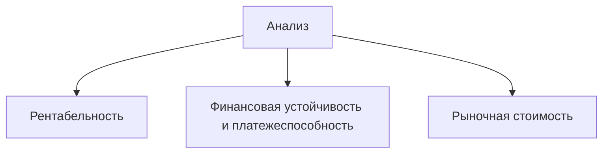

Фундаментальный анализ позволяет оценивать компании по их финансовым показателям и сделать выводы о перспективности вложений в них денег.

Чтобы проанализировать компанию, инвесторы изучают ее финансовые отчеты, политическую и экономическую ситуацию в стране, конкурентов и т.д. 
Эта информация позволяет предположить *настоящую* или справедливую стоимость акции, а после сравнить ее с рыночной ценой акции и решить для себя, вкладывать деньги или нет.

**Пример:**
Вероника решила купить себе квартиру. Она может это сделать двумя способами:
1. Купить первую попавшуюся квартиру с подходящей ценой. В этом случае есть риск заселиться в некомфортную квартиру или в квартиру с юридическими проблемами. Это значительно усложнит проживание и продажу в будущем.
2. Почитать про застройщика, посмотреть расположение квартиры и наличие инфраструктуры, изучить материалы, из которого построен дом узнать про качество воды в районе, сравнить цены на квартиры, спрогнозировать, будут ли цены на квартиры в этом районе расти или падать и т.д. Всесторонний подход к выбору поможет сократить вероятность проблем с жильём и повысит вероятность заработать на продаже.

>Второй вариант выбора квартиры по параметрам и будет фундаментальным анализом квартиры. 

Если текущая цена акции ниже ее *настоящей* цены, то такая акция считается **недооцененной**. Со временем инвесторы могут понять перспективы и деятельность компании и начать активно покупать акции, что приведет к росту их цены.

Если текущая цена акции выше ее *настоящей* цены, то такая акция считается **переоцененной**.

Фундаментальный анализ популярен у долгосрочных инвесторов. Потому что с момента оценки компании до роста ее акций могут пройти месяцы и даже годы.

Часто под фундаментальным показателем понимают только анализ финансовых отчетов и мультипликаторов с коэффициентами, что верно лишь на треть. 
Чтобы **проанализировать компанию** и ее перспективы инвестору нужно:
- Оценить макро- и микроэкономику, рыночные циклы;
- Изучить финансовые и операционные показатели компании, мультипликаторы и коэффициенты.
- Проанализировать слабые и сильные стороны компании, а также риски и возможности - SWOT-анализ.

>**Важно!** Анализ финансовых отчетов говорит лишь о прошлом компании, но не позволяет сделать прогнозы на будущее.

На первых порах начинающему инвестору подойдет упрощенный вариант анализа. Для этого достаточно использовать готовые данные из отчетов и значения мультипликаторов на сайтах - скринерах.

Для анализа компании нужно проанализировать три стороны бизнеса.

---

### Как анализировать рентабельность бизнеса

Любой бизнес создается ради получения прибыли. Компании которые ничего не зарабатывают или с расходами выше доходов, считаются неприбыльными и исчезают с рынка.

Прибыльность бизнеса можно оценить за счет **рентабельности**.

>**Рентабельность** - это показатель эффективности работы компании. Он показывает, сколько прибыли приносят вложенные средства.

Высокая выручка не всегда означает высокую рентабельность.
Для оценки **рентабельности** и прибыльности бизнеса используются следующие показатели:
- Operating income / Sales;
- EBITDA / Sales;
- Net income / Sales;
- ROE;
- ROA;
- FCF;
- EPS;

>**Важно!** Желательно запоминать названия показателей на английском языке, так как в статьях аналитиков и на сайтах они представлены чаще в таком виде.

Когда компания продает продукт или услугу, она получает за это деньги. Эти деньги называются **выручкой (sales)**. На производство продукта и оказания услуг компания тоже тратит деньги, то есть несет **расходы**. К ним относятся затраты на производство, рекламу, транспортировку, проценты за использование кредитов, налоги и т.д.

Если вычесть из выручки разные типы расходов, можно получить разные **типы прибыли:**

#### Операционная прибыль

$$
\begin{aligned}
\text{Операционная прибыль} = &\ \text{Выручка} \\
&- \text{Расходы на себестоимость} \\
&- \text{Коммерческие расходы} \\
&- \text{Административные расходы}
\end{aligned}
$$

**Себестоимость** - расходы, связанные с производством товара или услуги.
**Пример:**
Если вы производите и продаете горшки для цветов, то под себестоимостью могут пониматься затраты на глину, зарплату гончару, краски для росписи горшков и т. д.

**Коммерческие и административные расходы** - расходы, связанные с продажей товаров и услуг.
**Пример:**
Расходы на рекламу, на зарплату персоналу (юристы, бухгалтеры, маркетологи и прочее), на аренду помещений и так далее. Эти расходы не связаны с производством услуги или товара.

#### EBITDA

$$
\begin{aligned}
\text{EBITDA} = &\ \text{Выручка} \\
&- \text{Расходы на себестоимость} \\
&- \text{Коммерческие расходы} \\
&- \text{Административные расходы} \\
&+ \text{Амортизация}
\end{aligned}
$$

**Амортизация** - расходы, связанные с возмещением износа активов.
**Пример:**
Компания приобрела автомобиль за 1 000 000 руб. Компания планирует использовать автомобиль 10 лет. В финансовой отчетности компания списывает по 100 000 руб. в год на амортизацию. Ее компания использует в качестве расхода. Фактически компания ничего не потеряла, но выручка на бумаге уменьшится.

>**EBITDA** - отдельный показатель, который не встретить в отчетах. Он не бухгалтерский. Этот показатель придумали инвесторы для сравнения рентабельности компаний без учета расходов, на которые влияют процентные ставки по кредитам, налоговые стратегии и разные виды амортизации оборудования.
>
>*Как сравнить компании из одной отрасли, но которые работают в разных странах?* *Ведь налоги и проценты по кредитам в разных странах разные. Тут и смотрят на **EBITDA***.

#### Чистая прибыль

$$
\begin{aligned}
\text{Чистая прибыль} = &\ \text{Выручка}- \text{Все расходы}
\end{aligned}
$$

Анализ выручки и прибыли помогает оценить, сколько денег приносит бизнес и на сколько он рентабельный.

---

### Как использовать Рентабельность EBITDA, EBITDA / Sales, EBITDA margin

*Все три показателя относятся к одному и тому же понятию.*

Показатель позволяет оценить **долю прибыли в выручке** компаний. С этой же целью могут быть использованы:
- Operating income / Sales или Operating margin (Операционная прибыль / Выручка или Операционная рентабельность);
- Net income / Sales или Net margin ( Чистая прибыль / Выручка bkb Рентабельность чистой прибыли);

Все три показателя объединяет выручка в знаменателе, поэтому и рассматривать их можно вместе.

>**Пример:**
>Инвестор рассматривает две компании А и Б. Компания А за год продала товаров и услуг на 5 650 000 руб., компания Б на 7 200 000 руб. У компаний были сопутствующие расходы, связанные с производством товаров, рекламой, налогами и т.д. Чиста прибыль компании А составила 2 350 000 руб., компании Б 3 700 000 руб. 
>Инвестору хочется понять, у какой компании доля чистой прибыли в выручке больше. Для этого нужно рассчитать рентабельность чистой прибыли и понять у кого она выше.
>
>Компания А
>2 350 000 / 5 650 000 = 0.4159 (41%)
>
>Компания Б
>3 700 000 / 7 200 000 = 0.5138 (51%)

Чем **выше** рентабельность бизнеса, тем **лучше** управляется компания. Оптимизация расходов ведет к увеличению прибыли, которая может быть инвестирована обратно в бизнес и/или разделена между акционерами в виде дивидендов.

*Компании следует сравнивать из одной отрасли.*

---

### Как использовать Рентабельность активов, ROA

Активы компании - это то, чем она владеет и что помогает ей зарабатывать деньги. 

>Активы компаний, которая занимается продажей цветов: магазины, прилавки, вазы, цветы, упаковочная бумага, ленты, кассовый аппарат, прочий инвентарь и т.д.

**Коэффициент ROA (Return on assets)** - показывает, насколько эффективно компания использует свои активы для генерации прибыли.

$$
ROA = \frac{\text{Чистая прибыль}}{\text{Активы компании}}
$$

>**Пример:**
>Чиста прибыль компании А составила 2 350 000 руб., компании Б 3 700 000 руб. 
>Компания А владеет активами общей суммой на 20 500 000 руб., компания Б - 25 250 000 руб.
>Рентабельность активов компании А:
>2 350 000 / 20 500 000 = 0.1146 (11%)
>Рентабельность активов компании Б:
>3 700 000 / 25 250 000 = 0.1465 (14%)
>Бизнес компании Б рентабельнее, чем бизнес компании А. Это значит, что она эффективнее использует свои активы для получения прибыли.

---

### Как использовать Cвободный денежный поток, FCF

**FCF (Free cash flow)** - один из самых важных показателей в оценке компаний. Он представляет собой полученные за период деньги, которыми компания располагает после затрат на поддержание бизнеса (капитальные затраты).

**Пример:**
Оксана зарабатывает 70 000 руб. в месяц. Каждый месяц ей нужно платить за аренду квартиры - 30 000 руб., на продукты уходит 20 000 руб. Получается 50 000 руб. - необходимые затраты на поддержание жизни Оксаны. А 20 000 руб. она может спокойно тратить: проходить курсы повышения квалификации, помочь родственникам, положить на депозит и так далее.
20 000 руб. - это **свободные денежный поток** Оксаны.

Хорошим признаком является **положительный FCF**, который растет из периода в период. Это значит у компании остаются деньги, которые она может инвестировать в расширение бизнеса, погасить кредит, выплатить дивиденды, осуществить байбек и т.д.

**Отрицательный FCF** указывает на то, что заработанных компанией денег не хватает на поддержание бизнеса. Приходится брать кредиты и займы и увеличивать долговую нагрузку.

---

### Как использовать прибыль на акцию, EPS

**EPS (Earnings per share)** - прибыль на акцию, которая показывает размер чистой прибыли, который приходится на 1 обыкновенную акцию компании. 

>Для инвестора важно. чтобы **EPS** был положительным и увеличивался из периода в период.

**Из-за чего может расти EPS:**
- У компании увеличилась чистая прибыль - увеличилась выручка или сократились расходы. Такой вариант наиболее предпочтителен для инвестора и говорит о развитии и расширении бизнеса.
- У компании уменьшилось количество обыкновенных акций - компания провела байбек и погасила часть акций.

---

### На что обратить внимание при анализе рентабельности

**FCF** и **EPS** должны быть положительны и расти из года в год. Единичные случаи с отрицательными значениями также возможны, но не должны быть на постоянной основе.

При выборе компаний из одной отрасли привлекательнее будут компании с высокими показателями **ROA**, **рентабельности EBITDA**, **операционной рентабельности** и **рентабельности чистой прибыли**.

Значения показателей в разных отраслях могут отличаться. В одной отрасли операционная рентабельность в 30% будет хорошим показателем, а в другом - плохим.

---

### Как анализировать финансовую устойчивость и платёжеспособность

Одним из основных показателей любой компании является ее финансовая устойчивость и платежеспособность. Эти характеристики показывают способность компании своевременно расплачиваться по своим обязательствам. Компании с хорошими показателями с большей вероятностью переживут кризис и не обанкротятся.

**Пример:**
Василий получает зарплату 50 000 руб. На еду и прочие нужны он тратит 25 000 руб. При этом у Василия есть ипотека, и ежемесячный взнос составляет 22 000 руб.
Василия сократили, а на новой работе он начал получать 45 000 руб. У Васи возникли трудности с погашением ипотеки. Он вспомнил про гараж, который сможет продать для погашения долга.

Такие ситуации нередки и в мире компаний. Потому важно оценивать кредитную нагрузку и устойчивость компании прежде, чем становиться ее акционером.

О финансовой устойчивости и платежеспособности можно судить по показателям:
- **Debt/Equity**;
- **Net debt/EBITDA**;
- **Current ratio**;
- **L/A**;

При оценке платежеспособности компании инвестор сталкивается с понятием заемного капитала.

К заемному капиталу относятся:
- **Кредиты в банке**;
- **Облигации**;
- **Кредиторская задолженность**;
- **Обязательства по налогом и прочее**;

>Инвестору интересны кредиты и займы (*облигации*), совокупность которых инвесторы называют **долгом (Debt)**. Мультипликаторы и коэффициенты, которые характеризуют устойчивость и платежеспособность компании, часто рассчитываются в отношении долга.

---

### Как использовать Долг / Собственный капитал, Debt / Equity

Коэффициент показывает, как размер долга соотносится с размером собственного капитала.

**Пример:**
Вы решили купить машину за 1.5 млн. руб. У вас есть 1 млн. руб. поэтому вы берете в банке кредит 500 тыс. руб.
Если поделить деньги, которые взяты в долг, на ваши деньги, то получим коэффициент 0.5. Размер долга равен половине сумме собственных средств.
Если будет нечем платить по кредиту, то можно продать машину и вернуть долг. При этом есть запас "*прочности*" - стоимость машины может упасть до 500 тыс. руб. и никаких проблем с банком не будет.

Чем выше коэффициент, тем менее устойчивым становиться бизнес. Значение 1 говорит о том, что размер долга равен размеру собственных средств. Поэтому важно, чтобы коэффициенты **Debt/Equity** не был выше 1.

>Отрицательное значение говорит о проблемах с собственным капиталом. Он отрицательный из-за накопленного убытка. Нужно изучить причины отрицательного собственного капитала и наблюдать за компанией.

---

### Как использовать Чистый долг / EBITDA, Net debt / EBITDA

Кроме понятия *долг* инвестор сталкивается с понятием **чистый долг** - показывает размер долга после того, как компания пустит все деньги на счетах на его погашение.

**Пример:**
У Андрея есть вклад в банке в размере 100 000 руб. Молодой человек присмотрел гараж стоимостью 250 000 руб. и решил взять кредит на его покупку. Закрывать вклад он не захотел, чтобы не терять проценты.
Долг Андрея перед парком составляет 250 000 руб., но у него есть вклад на 100 000 руб. Андрей в любое время может закрыть вклад и направить деньги на погашение долга. **Чистый долг** Андрея перед банком составляет 250 000 руб. - 100 000 руб. = 150 000 руб.

>Мультипликатор **Чистый долг/EBITDA** показывает, за сколько лет компания сможет погасить чистый долг за счет **EBITDA**, если показатели не будут меняться.

**Пример:**
**Чистый долг** Андрея составляет 150 000 руб. За месяц работы Андрей получает 50 000 руб. Это сумма до вычета налога, до уплаты процентов по кредиту и до откладывания денег на амортизацию гаража. Если бы Андрей направлял всю сумму на погашение долга, он бы справился с ним за 3 месяца.
150 000 руб. / 50 000 руб. = 3

>Мультипликатор **Net debt / EBITDA** популяр среди инвесторов. Он является показателем платежеспособности компании - за сколько лет компания может закрыть свой долг.
>
>Референсное значение мультипликатора находится в пределах 3 (лет). Чем меньше показатель, тем платежеспособнее компания.

Некоторые отрасли могут позволить себе значение выше - и это для них нормальное явление. Обычно высокие значения наблюдаются в потребительском секторе и секторе телекоммуникаций. В этих секторах у компаний стабильный денежный поток. Люди постоянно покупают товары первой необходимости и пользуются услугами связи.

У показателя может быть **отрицательное значение.** Причинами могут быть:
- У компаний отрицательный **чистый долг** - бывает, когда размер денег на счетах больше долга. Компания в любой момент может его погасить, при этом часть денег останется.
- У компании отрицательное значение **EVITDA** - иногда компания тратит на свою деятельность больше, чем зарабатывает. В итоге она получает отрицательную прибыль - и ей нечем закрывать чистый долг.

С одной стороны - плохо, что компания не покрывает все свои расходы. Но и говорить о неустойчивости компании нельзя. В таких случаях лучше добавить компанию в список для дальнейшего наблюдения.

---

### Как использовать Коэффициент текущей ликвидности, Current ratio

Активы компании и заемный капитал имеют **краткосрочную и долгосрочную части**.

**Пример:**
В цветочной компании магазины, прилавки, кассовые аппараты будут долгосрочными активами. Их используют долгое время, и они участвуют в создании дохода. Долгосрочные активы называют *внеоборотными*.
Цветы, упаковка, ленточки будут относится к краткосрочным или *оборотным* активам. Они быстро оборачиваются в деньги: закупили на деньги цветы, упаковку, ленты -> продали красиво оформленные цветы -> закупили на деньги новую партию цветов, упаковки, лент.

Также заёмный капитал распределяется по следующему принципу:
 - Все, что нужно погасить в течение 12 месяцев, относится к краткосрочному;
 - Все, что нужно погасить в сроки свыше 12 месяцев - к долгосрочному;

>Для понимания **коэффициента текущей ликвидности** нужно представить ситуацию, когда компания перестала генерировать выручку. При этом краткосрочную часть кредитов и займов нужно закрыть в течение года.

Для погашения долгов компания может начать продавать свои активы. Продать проще *оборотные* активы (цветы, ленты, упаковку), чем *долгосрочные* (прилавки, кассовые аппараты, магазины).

**Коэффициент текущей ликвидности** - показывает, сможет ли компания за счет краткосрочных активов покрыть краткосрочные кредиты. Для этого размер краткосрочных активов делится на размер краткосрочных кредитов.

**Пример:**
У цветочной компании оборотных (краткосрочных) активов куплено на 2 000 000 руб. Размер краткосрочного заемного капитала составляет 1 500 000 руб.
Коэффициент текущей ликвидности равен: 2 000 000 руб. / 1 500 000 руб. = 1.33
Денег с продажи оборотных активов хватит, чтобы покрыть все краткосрочные обязательства компании.

>Если **коэффициент текущей ликвидности** больше или равен 1, то это означает, что денег с продажи оборотных активов хватит на полное погашение краткосрочного долга.
>
>То есть данный показатель отражает финансовую устойчивость компании на ближайший год. Желательно выбирать компании, у которых значение равно **1 и выше**.

---

### Как использовать Обязательства / Активы, Liabilities-to-Assets, L / A

Соотношение размера обязательств (всего заемного капитала) к размеру всех активов показывает, какая часть активов компании состоит из обязательств.

**Пример:**
Машина стоит 1.5 млн. руб. На ее покупку был взят кредит 500 000 руб., своих денег было 1 млн. руб. 
- 500 000 руб. - это обязательства;
- 1 500 000 руб. - это активы;
500 000 руб. / 1 500 000 руб. = 33%
На 33% ваш актив профинансирован за счет заемных средств (обязательств).

>Значение показателя **больше 70%** обычно указывает на потенциальные проблемы с финансовой устойчивостью. Однако быстрорастущие компании часто имеют высокое соотношение обязательств к активам. Потому что за счет заемных средств молодые компании быстрее развиваются и захватывают рынок

Компании с низким показателем **L / A** имеют больше шансов получить кредит в банке и выглядят более привлекательными для инвесторов.

---

### На что обратить внимание при анализе финансовой устойчивости и рентабельности

Чтобы выбрать финансово устойчивую компанию, в первую очередь, нужно обратить внимание на показатель **Net debt / EBITDA**. У компании может быть большой заемный капитал, но при этом компания постоянно генерирует большой денежный поток и быстро может погасить долг. 

Показатель этого мультипликатора должен быть в пределах **3**. Но лучше сравнивать со средним показателем по отрасли, компании некоторых отраслей имеют более высокие значения.

Обращайте внимание на отрицательный показатель **Net debt / EBITDA**. Помните про причины появления подобного значения.

Коэффициент **L / A** должен быть в пределах **от 50% до 70 %**. Низкий показатель может говорить об осторожности компании. Она не хочет брать кредит и не использует его для быстрого развития. Если показатель высокий, то возникает вопрос об устойчивости компании.

По показателю **Debt / Equilty** референсное значение составляет **60% - 90%**.

Значение **Current ratio** от **1 и выше** говорит об устойчивости компании. При необходимости она может быстро погасить краткосрочные обязательства.

---

### Как анализировать рыночную стоимость

Показатели оценки стоимость компании давно используются для понимания, насколько акции недооценены или переоценены по сравнению с конкурентами.

Под **мультипликаторами рыночной стоимостью** понимают соотношение стоимости предприятия и его доходов, денежных потоков, балансовой стоимости и т.д.

Анализ проводят по показателям:
- **P/E**;
- **P/B**;
- **P/S**;
- **EV/EBITDA**;

---

### Как использовать P / E, Price to Earnings

Он связывает цену акций с прибылью на акцию (**EPS** ) и показывает сколько денег инвестор готов платить за 1 денежную единицу прибыли компании. 

Мультипликатор рассчитывается 2 способами:
- С использованием прибыли на акцию

$$
\frac{P}{E} = \frac{\text{Цена акции}}{EPS}
$$

- С использованием чистой прибыли

$$
\frac{P}{E} = \frac{\text{Стоимость компании}}{\text{Чистая прибыль}}
$$

Для компаний, торгующихся на бирже, в качестве стоимости используют **рыночную капитализацию**.

**Рыночная капитализация** - стоимость всех выпущенных акций компании.

Значение **P / E** помогает инвестору сравнивать компании с разной стоимостью и прибылью.

**Пример:**
Марина хочет приобрести бизнес. 
На выбор имеется две компании:
- Компания А стоит 15 000 000 руб.;
- Компани Б стоит 23 000 000 руб.;
Перед принятием решения Марина хочет посмотреть на прибыль, которую генерируют компании.
Компания А за год зарабатывает 2 500 000 руб., компания Б - 4 200 000 руб.
**P / E** компании А = 15 000 000 руб. / 2 500 000 руб. = 6
**P / E** компании Б = 23 000 000 руб. / 4 200 000 руб. = 5.5
При покупке компании А Марина заплатит 6 руб. за каждый рубль прибыли компании. Компания Б будет стоить Марине 5.5 руб. за каждый рубль прибыли компании.
При прочих равных приобретение компании Б выгоднее.

>Бывает так, что показатель **P / E** компании на протяжении многих лет выше среднего значения по отрасли и выше, чем у конкурентов. Причиной может быть стабильно хорошие результаты лучше других компаний и перспективы. Инвесторы хотят обладать акциями такой компании, в результате чего цена акций растет и увеличивает показатель **P / E**.

Для выбора компаний из одной отрасли сравнивают их мультипликаторы:
- **Между собой**;
- Со **средним историческим** показателем самой компании;
- Относительно **среднего значения** по отрасли;

---

### Как использовать P / S, Price to Sales

На рынке много развивающихся компаний, которые не имеют положительной **чистой прибыли**. Их расходы на развитие и захваты рынка пока не покрываются доходами.

Если у компании чистая прибыль отрицательная, то мультипликатор **P / E** будет отрицательным. В этом случае он становится бесполезным для инвесторов.

Для сравнения стоимости развивающихся компаний используют мультипликаторы - **P / S**.
Он рассчитывается с использованием цены акции и выручки компании:

$$
\frac{P}{S} = \frac{\text{Цена акции}}{\text{Выручка на акцию}}
$$

**Выручка** используется, потому что **не может быть отрицательной**.

>Принцип работы с мультипликатором такой же, как и с **P / E**.

---

### Как использовать P / B, Price to Book value

$$
\frac{P}{B} = \frac{\text{Цена акции}}{\text{Балансовая стоимость на акцию}}
$$

Мультипликатор соотносит рыночную стоимость компании с размером балансовой стоимости компании. 
**Балансовая стоимость** - это, по сути, и есть собственный капитал акционеров.

Инвестор с помощью **P / B** может понять - не переплачивает ли он за тот остаток, который он может получить, если компаний объявит себя банкротом.

**Пример:**
Размер активов компании - 100 000 000 руб. Собственный капитал составляет 30 000 000 руб., заемный - 70 000 000 руб. 
Компания объявляет себя банкротом. Имущество (активы) компании распродаются и часть денег (70 000 000 руб.) идут на погашение всех обязательств.
Оставшаяся часть - собственный капитал в размере 30 000 000 рублей, распределяются между всеми акционерами.
У компании 100 000 акций. Если собственный капитал поделить на количество акций, на каждую акцию придется 300 руб.
Инвесторы, купившие акцию за 300 руб., вернут свои деньги и не получат ни дохода, ни убытка. Если акция была куплена дешевле, инвесторы зарабатывают, если меньше - терпят убыток.

>Значение **P / B** равное 1 - цена акции равняется балансовой стоимости на акцию (*справедливая цена акции*), больше 1 - цена акции больше балансовой стоимости на акцию (*акция переоценена*), меньше 1 - цена акции меньше балансовой стоимости на акцию (*акция недооценена*).

*Мультипликатор больше подходит для оценки банков, нежели для остальных компаний.*

---

### Как использовать EV / EBITDA, Enterprise Value / EBITDA

Мультипликатор показывает, за сколько лет компания сможет купить сама себя за счет **EBITDA**, если стоимость и размер прибыли не будут меняться. 

$$
\frac{EV}{EBITDA} = \frac{\text{Стоимость компании}}{EBITDA}
$$

Мультипликатор поход на **P / E**. Но в отличие от него позволяет сопоставлять компании с разной амортизацией, долговой и налоговой нагрузкой.

>Помните, что **EBITDA** - это прибыль до расходов на амортизацию, процентов по кредитам и налога на прибыль.

*Принцип работы с этим мультипликатором совпадает с **P / E***.

---

При выборе бумаги в ядро портфеля **фундаментальный анализ первичен**. Он позволяет выбрать надежных эмитентов с эффективным бизнесом, а вот определить точку входа и возможные сценарии поведения цены позволяет технический анализ.