**Технический анализ** - это прогноз движения цены на основании её изменения в прошлом с использованием специальных инструмент.

**Главная идея технического анализа** - все возможные события уже заложены в цену. Финансовая отчетность, новостной фон, действия конкурентов, прогнозы аналитиков, общие настроения рынка, инсайдерские сделки и т. д. - все это отражено в цене.

Технический анализ самодостаточен и изучает движение и изменение цены без учета внешних факторов. Использовать технический анализ можно как для анализа целых индексов, так и для анализа отдельных акций, фьючерсов, криптовалют.

>**Важно!** Применение технического анализа не гарантирует получение прибыли. Технический анализ является вариативным инструментом и предполагает несколько вариантов движения цены в будущем.

Ценой активов на рынке управляют его участники. Технический анализ *сводится к изучению графика цены* и построению предположений о ее динамике. А она определяется психологией поведения продавцов и покупателей.

**От чего зависит цена на рынке:**

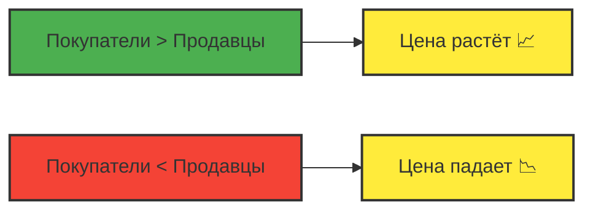
```mermaid
graph LR
    A[Покупатели > Продавцы] --> D[Цена растёт 📈]
    C[Покупатели < Продавцы] --> E[Цена падает 📉]
    
    style A fill:#4CAF50,stroke:#333,stroke-width:2px
    style C fill:#f44336,stroke:#333,stroke-width:2px
    style D fill:#ffeb3b,stroke:#333,stroke-width:2px
    style E fill:#ffeb3b,stroke:#333,stroke-width:2px
```

Технический анализ делится **на два вида**:
- **Графический**;
- **Индикаторный**;

**Графический анализ** появился в конце 19-го - начале 20 века и актуален по сей день. Он помогает оценить график цены с помощью:
- Построения уровней;
- Построения трендов;
- Поиска и анализа геометрических фигур;

**Индикаторный анализ** позволяет определить состояние рынка в конкретный момент и принять решение о сделке на основании его сигналов. 

Различают **три группы индикаторов**:
- **Трендовые индикаторы** - Moving Average, MACD, облако Ишимоку;
- **Осцилляторы** - RSI, Стохастический осциллятор, Momentum, гистограмма MACD;
- **Индикаторы объема**;

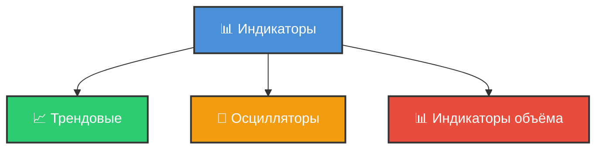
```mermaid
graph TD
    A[📊 Индикаторы] --> B[📈 Трендовые]
    A --> C[🔄 Осцилляторы]
    A --> D[📊 Индикаторы объёма]
    
    style A fill:#4A90D9,color:#fff,stroke:#333,stroke-width:2px
    style B fill:#2ECC71,color:#fff,stroke:#333,stroke-width:2px
    style C fill:#F39C12,color:#fff,stroke:#333,stroke-width:2px
    style D fill:#E74C3C,color:#fff,stroke:#333,stroke-width:2px
```

>*Трендовые индикаторы* и *индикаторы объема* обычно отображаются на самом графике цены, а осцилляторы - под графиком в отдельной области. У осцилляторов есть собственная шкала измерения.

---

### Где изучать графики

Один из самых популярных и удобных ресурсов для **технического анализа** графиков цены - сайт https://ru.tradingview.com/

Он позволяет анализировать ценные бумаги мировых бирж, экономические показатели, общаться с инвесторами и отслеживать идеи фондового рынка.

>В бесплатной версии доступны многие инструменты. Если из недостаточно, можно приобрести платную подписку. Для использования графика и сохранения информации потребуется зарегистрироваться.

---

### Какими бывают графики

Существует много способов построения графиков цены. Для начала достаточно знать три самых распространенных:
- **Линейный график**;
- **Бары**;
- **Японские свечи**;

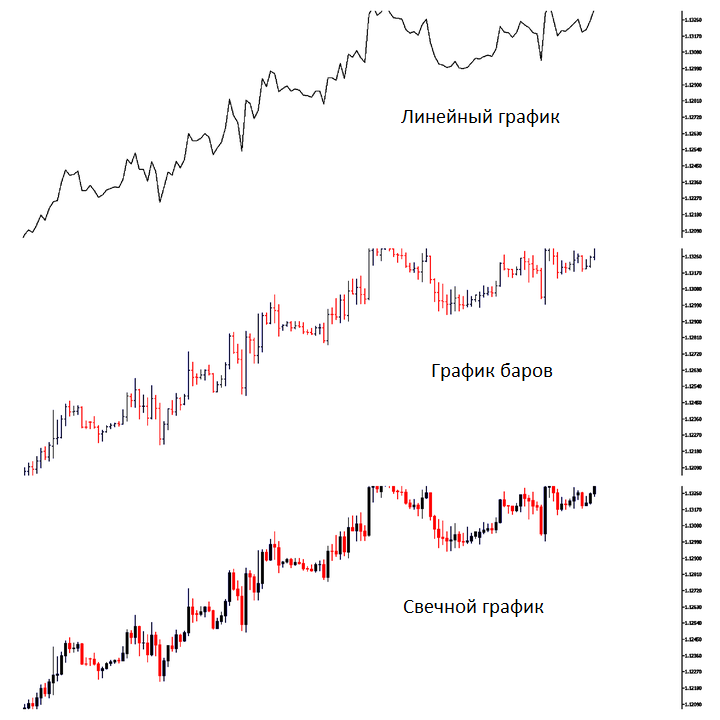

>Обычно инвесторы используют графики свечей или баров. Линейное отображение почти не используется, потому что дает мало информации.

Для построения графиков типа "Бары" и "Свечи" используются **четыре значения цены**:
- **Цена открытия**;
- **Цена закрытия**;
- **Максимальная цена**;
- **Минимальная цена**;

|📌 Значение|🏷️ Название и обозначение|📖 Что это значит|
|---|---|---|
|Цена открытия|`open`, **O**|цена первой сделки за выбранный период|
|Цена закрытия|`close`, **C**|цена последней сделки за выбранный период|
|Максимальная цена|`high`, **H**|максимальная цена сделки за выбранный период|
|Минимальная цена|`low`, **L**|минимальная цена сделки за выбранный период|

---

### Как устроены свечи и бары

**Японские свечи** - вариант графического отображения изменений цены за определенный промежуток времени, который называется *таймфрейм* (прим. далее ТФ).

**Пример:**
На таймфрейме 1 день (D), то есть в одной свече содержится информация о цене открытия торгов, цене закрытия торгов, о максимальной и минимальной значении цены за целый день.
*Одна свеча ТФ D содержит в себе 10 свечей ТФ 1 час (1H) и т. д.*

Свечи могут быть:
- Бычьими;
- Медвежьими;

**Бычья свеча (зеленая)** говорит о том, что за заданный промежуток времени цена выросла.

**Медвежья свеча (красная)** говорит о том, что за заданный промежуток времени цена снизилась.

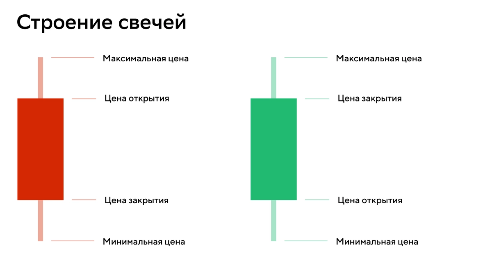
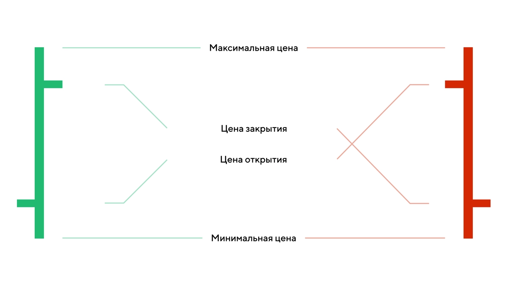
>Инвестор сам выбирает удобный для него тип свечей.

---

### Что такое таймфрейм

**Таймфрейм** - временной интервал, за который формируется одна свеча или бар.

*Таймфреймы могут быть от 1 секунды до 1 месяца.*

При выборе **ТФ** 1 час на графике каждая свеча или бар равны изменению цены за 1 час.
Долгосрочным инвесторам для анализа цен подходят старшие Таймфреймы:
- 1 день;
- 1 неделя;
- 1 месяц;

---

### Как анализировать с помощью графических инструментов

К графическим инструментам относят тренды, уровни и графические фигуры.
### Как построить и использовать тренд
**Тренд** - общее направление цены на графике за определенный период времени. Он позволяет прогнозировать дальнейшее движение цены.

**Тренд может быть:**
- Восходящим;
- Нисходящим;
- Отсутствовать, тогда это называется боковик, диапазон, консолидация;

Для построения тренда нужно определить на графике минимумы и максимумы:
- Минимумы - минимальные значения цены;
- Максимумы - максимальные значения цены;

**Как выглядят минимумы и максимумы на графике**

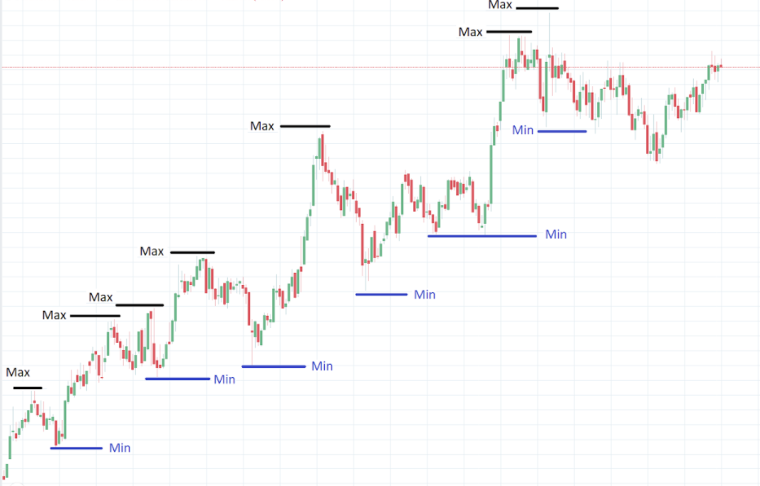

**Восходящий тренд** строится по двум минимумам снизу цены. Первой точкой выступает самый низкий минимум.
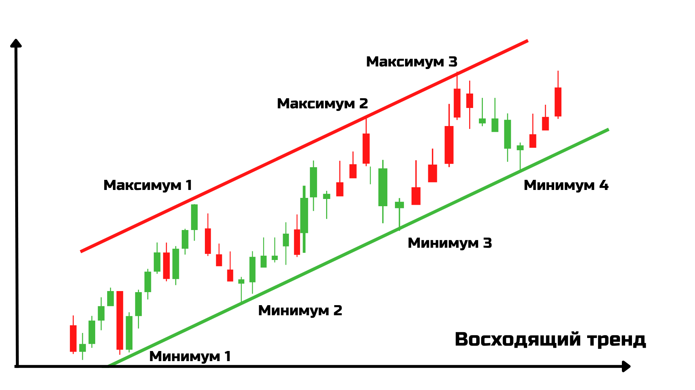
**Принципы построения восходящего тренда:**
1. Максимально отдалить график на выбранном таймфрейме.
2. Восходящий тренд строят по минимумам.
3. Найти первую точку - это самая минимальная точка на графике.
4. Найти вторую точку - следующий минимум на графике**должен быть выше** предыдущего.
5. Соединить точки и провести линию тренда.

>**Важно!** Пока максимумы обновляются, восходящий тренд продолжается. Все следующие минимумы не должны опускаться под линию тренда.

**Нисходящий тренд** строится сверху графика по двум максимумам цены. Первая точка - самый высокий максимум.

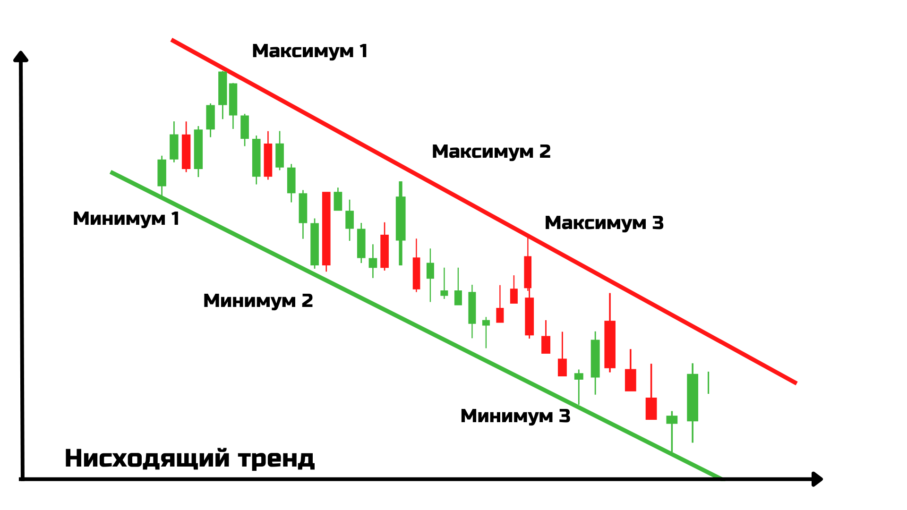
**Принципы построения нисходящего тренда:**
1. Максимально отдалить график на выбранном таймфрейме.
2. Нисходящий тренд строят по максимумам.
3. Найти первую точку - это самая максимальная точка на графике.
4. Найти вторую точку - следующий максимум на графике**должен быть ниже** предыдущего.
5. Соединить точки и провести линию тренда.

>**Важно!** Пока минимумы обновляются, нисходящий тренд продолжается. Все следующие максимумы не должны подниматься над линией тренда.

*При проведении **линии тренда** важно не срезать тела свечей / баров.*

**Боковой тренд.**
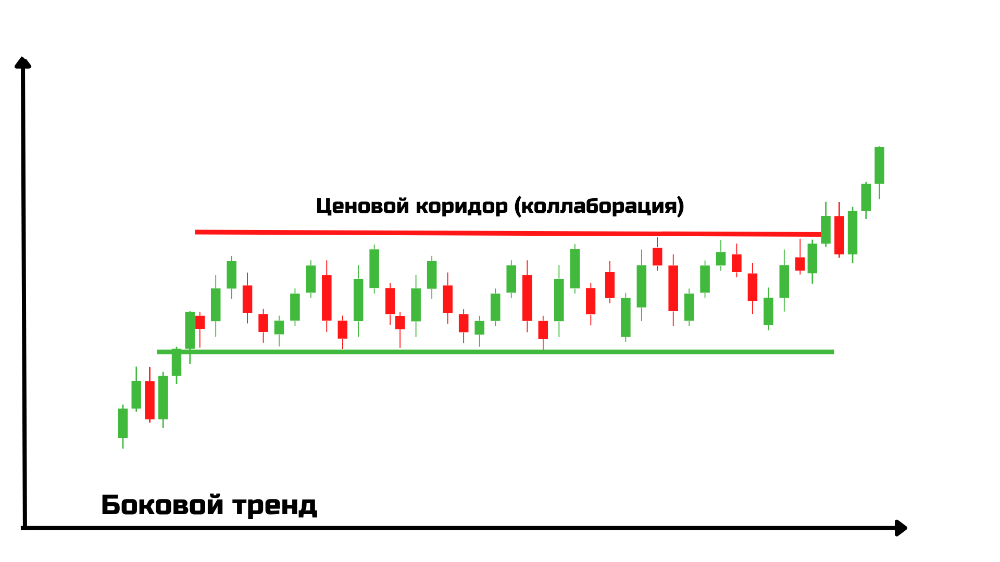
Когда цена уходит за линию тренда, говорят о его сломе. **Слом тренда** означает изменение направления цены. В этом случае нужно построить новый тренд.

Линии тренда строят для обозначения развивающегося в настоящий момент тренда и для определения момента разворота цены. Линии тренда можно использовать как **линии поддержки и сопротивления**. Так определяют точки входа и выхода из позиций.

>**Достоверной** линия тренда считается тогда, когда она проходит **не менее чем через три точки**. Чем чаще цена касается линии тренда, тем более она достоверна.

По **временному интервалу тренды делятся:**
- Глобальные;
- Локальные;

>Четкого временного интервала, который определяет глобальность и локальность тренда нет. Любой глобальный тренд состоит из серии локальных.

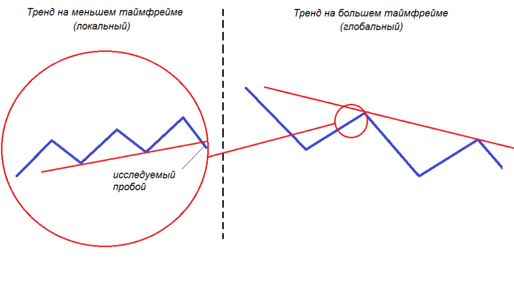

---

### Как построить и использовать уровни

**Уровень** - это точки на графике, где цена с большой вероятностью может поменять направление движения.

В этой точке возможно **два варианта развития событий**:
- Пробой;
- Отскок или отбой;

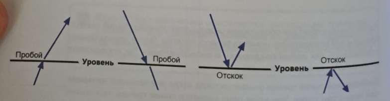

>Отскок и пробой определяют дальнейшее направление движения.

**Уровни могут быть:**
- Уровнями поддержки цены - цена движется вниз, достигает уровня и отталкивается от него, меняя направления движения;
- Уровнями сопротивления цены- цена движется вверх, достигает уровня и отталкивается от него, меняя направление движения;

>Один и тот же уровень в разных частях графика может выступать сопротивлением и поддержкой. Такие уровни называют **зеркальными**, они считаются сильными или подтвержденными.

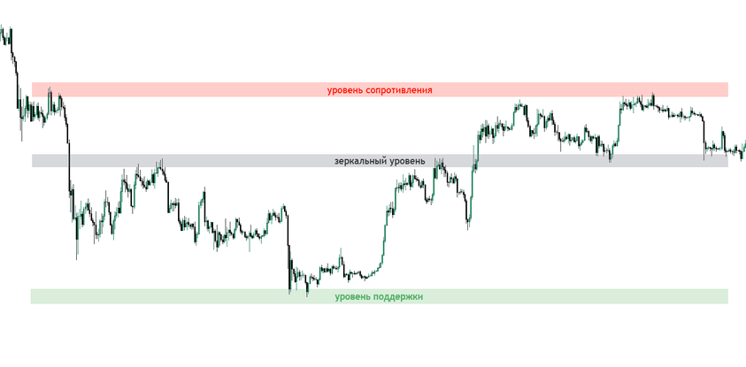
Расчертить уровни можно несколькими способами, комбинировать их нежелательно:
- По минимумам и максимумам;
- По зонам проторговок - зонам скопления значений цены. Обычно это 7 - 10 свечей в одной области цены.

**Как выглядят зоны проторговок на графике**
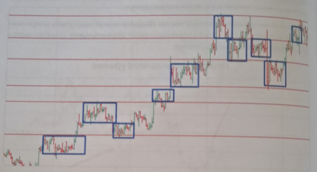

**Принципы построения уровней:**
1. Максимально отдалить график на выбранном таймфрейме;
2. Следовать по движению графика слева направо;
3. Проводить уровни по максимумам / минимумам или через зоны проторговок;

**Как выглядят уровни, построенные по минимумам и максимумам**
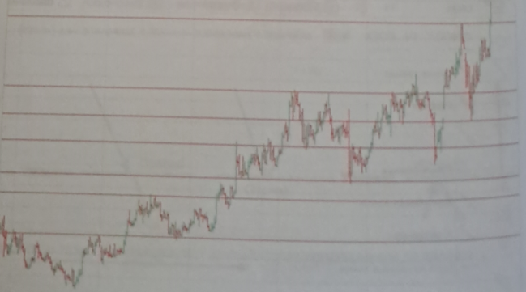

>Уровни можно использовать при поиске точек входа. Достижение ценной уровня может быть сигналом для инвестора. Цена может развернуться, оттолкнувшись от уровня, а может пробить уровень и продолжить дальнейшее движение.

---

### Как построить и использовать уровни Фибоначчи

> **0, 1, 1, 2, 3, 5, 8, 13, 21, 34, 55, 89, 144, ...**

$$F_0 = 0, \quad F_1 = 1 \
F_n = F_{n-1} + F_{n-2} \quad \text{для } n \ge 2$$

*Числа Фибоначчи встречаются повсюду* - в природе и жизни человека.

**Пример:**
Толщина кругов панциря улитки - толщина каждого последующего круга примерно равна сумме толщины двух предыдущих.
Отдаленность планет Солнечной системы - каждая следующая отдалена от солнца на расстояние, равное сумме расстояний двух предыдущих.

>Математически выявили, что соотношение каждого последующего числа в ряде Фибоначчи к предыдущему сводится к числу **1.618** - Золотое сечение Фибоначчи. А от него уже были высчитаны и другие числа: 0.236, 0.382, 0.618, 1.618, 2.618. 4.236.

**Уровни Фибоначчи** - это уровни, в которые цена приходит с большей долей вероятности.

Инструмент позволяет определить глубину коррекции к движению. Использовать его имеет смысл только при наличии **восходящего или нисходящего тренда**.

>Для построения уровней нужно выбрать инструмент "Коррекция по Фибоначчи".

**Принцип построения уровней Фибоначчи:**
1. Максимально отдалить график на выбранном таймфрейме;
2. Найти трендовое движение;
3. Найти **экстремумы** - максимальный значения тренда;
4. С помощью инструмента "Коррекция по Фибоначчи"  натянуть уровни между двумя экстремумами.

На **восходящем** тренде уровни строятся от минимума к максимуму. Это значит, что первая точка - самое маленькое значение цены, а вторая точка - самое большое значение цены на выбранном участке графике. На **нисходящем** тренде уровни строят от максимума к минимуму.

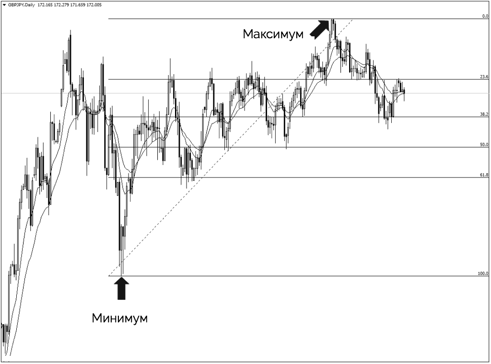

При начале коррекции эти уровни помогают определить глубину возможной коррекции.

Если цена достигла уровня в 23.6%, с большей вероятностью она *задержится* на этом уровне. После этого цена либо:
- **Оттолкнется** от уровня и продолжит движение по тренду;
- **Пробьёт** уровень и продолжит снижаться до уровня 38.2%, где снова произойдет *задержка*;

>Если нет коррекции к уровню 23.6%, то сетка Фибоначчи не считается **подтвержденной**.

Чем больше уровней пройдет цена, тем глубже коррекция. Когда цена достигает уровня 61.8%, можно говорить о смене тренда, поэтому нужно перестроить сетку Фибоначчи.

**Тактика использования** коррекции Фибоначчи строится на покупке ценной бумаги только при достижении цены уровней коррекции.

Совпадение уровней поддержки и сопротивления с уровнями Фибоначчи говорит о **сильной поддержке** на этом уровне. При достижении такого *двойного* уровня цена с большей долей вероятности *задержится* на нём и, возможно, завершит коррекционное движение.

>Уровни Фибоначчи привлекательны для цены и можно покупать или докупать актив, поставив заявки на указанные значения стоимости.

Существуют автоматические уровни, которые меняются в зависимости от динамики цены. Их не нужно строить самостоятельно, программа сама сделает это. инвестору достаточно только выбрать соответствующий инструмент. Речь идет об **индикаторах**:
- **Полосы Боллинджера**;
- **Ценовой канал**;
- **Конверты**;

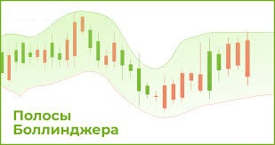

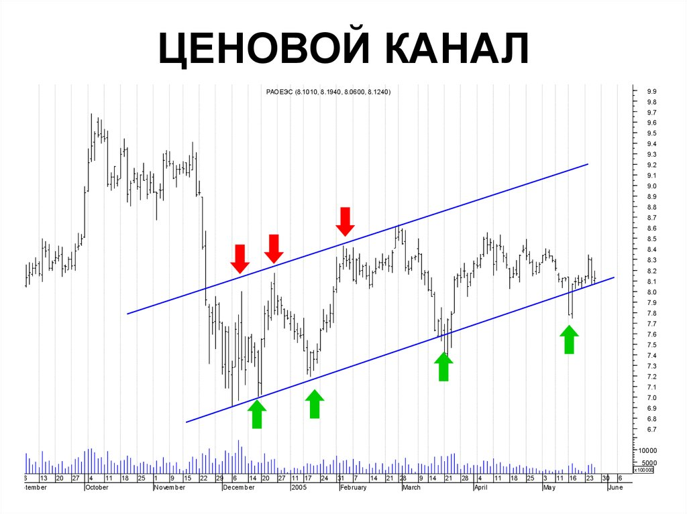

Суть **индикаторов** примерно одинаковая. У индикатора есть 3 линии (скользящие средние): две границы и средняя линия.

>Обычно цена движется внутри канала от одной границы до другой или от средней линии до границ. Выход цены за границы канала говорит об импульсном движении, которое может развиваться как вверх так и вниз. Указанные индикаторы хорошо работают в боковом движении, когда цена ходит от одной границы до другой.

---

### Как использовать индикатор объемов

**Объем** - это количество заключенных сделок за определенной период времени. Растущий объем говорит о влиянии на цену участников торгов. Они заставляют ее меняться - расти или падать.

Отслеживая динамику объема и направление изменения цены, можно понять, кто сильнее, а кто слабее - продавец или покупать. Сила и слабость полностью отражают количество сделок. Если слабый покупатель, значит мало сделок на покупку.

**Как выглядят классические объемы на графике**

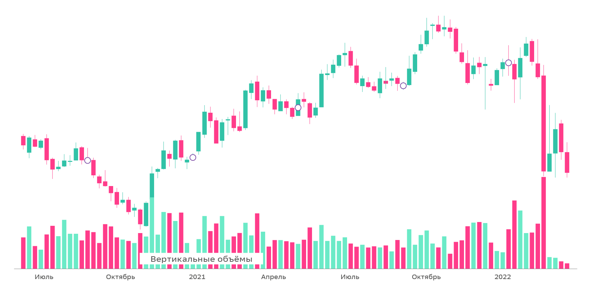
Данные об изменении объема и изменении цены могут подтвердить направление движения рынка. Или, наоборот, что данному движению цены доверять не следует:
- Цена и объем растут - покупатель сильнее, чем продавец. Рост цены подтвержден объемом;
- Цена падает, а объем растет - продавец сильнее, чем покупатель. В данном случае, объемы не подтверждают рост - вероятна коррекция.

**Смысл торгового объема** - отразить интерес инвесторов к бумаге. Если инструмент торгуется на низких объемах, значит, внимания к нему мало (**низкая ликвидность**) и наоборот.

**Объемы** визуально можно разделить на:
- Минимальные;
- Максимальные;
- Средние;

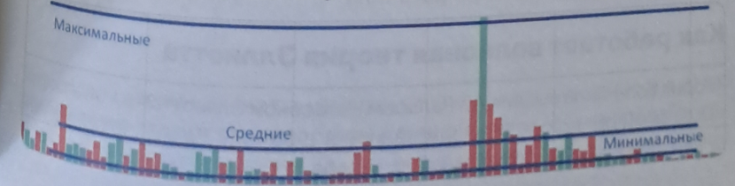

>**Важно!** Объемы показывают общее количество сделок. Из них нельзя выделить только сделки покупки или только сделки продажи.

**Пример:**
Инвестор в течение дня купил 200 акций и продал также 200 акций. Объем торгов инвестора - 400 акций в день.

---

### Как использовать объемы

**Пример:**
Цена падает. На графике стрелкой выделен бар, который ниже предыдущего экстремума с объемом крайне высоким по сравнению с предыдущими (*объем выделен нижней стрелкой*). Можем предположить, что данный бар станет разворотным - движение цены изменится на противоположное. 
**Важно**, чтобы последующие бары не обновляли текущий минимум - это станет подтверждением разворота.

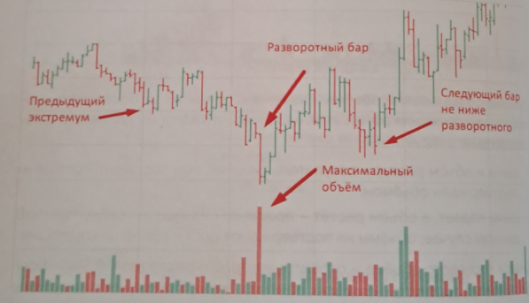

В качестве тактической идеи в такой ситуации можно купить актив по цене выше максимальной цены бара разворота. Но необходимо поставить **stop loss** за минимальную цену бара разворота.

**Stop loss** - заявка, которая помогает ограничить убытки инвестора. Купить или продать акции можно с помощью разных типов заявок. Инвестор должен уметь использовать каждую из них. *Чуть ниже вы познакомитесь с особенностями работы каждого типа*.

---

### Как работает волновая теория Эллиотта

Теория волн была выдвинута **Ральфом Нельсоном Эллиоттом**  в монографии **"Волновой принцип"**, опубликованной в 1938 году. Ее можно применить для любого торгуемого актива или товара.

>После выхода на пенсию во время тяжелой болезни Эллиотт занялся изучением графиков рыночных котировок. Он надеялся найти метод, который позволил бы определять закономерности рынка. Эллиотт пришел к выводу, что рынок, как продукт массовой психологии, подчиняется некоторому закону.

В основе волновой теории Эллиотта лежит циклическая закономерность в поведенческой психологии людей. Согласно его теории, поведение рыночных цен можно четко определить в выделить на графике в виде волн.

**Волна** - это ясно различимое ценовое движение.

**Волновая Теория Эллиотта гласит**, что рынок может находится **в двух широких фазах**:
- Бычий рынок;
- Медвежий рынок;

Эллиотт предполагает, что все движения цен на рынке разбиваются на:
- Пять волн в направлении основного тренда (*на рисунке ниже волны 1-5*);
- Три волны в обратном направлении (*на рисунке ниже волны A, B, C*);

При этом **волны делятся** на:
- **Импульсные волны** - создают направленный тренд (бычий или медвежий) и приводят рынок в значительное движение.
- **Коррекционные волны (откат)** - движение цены против тренда.

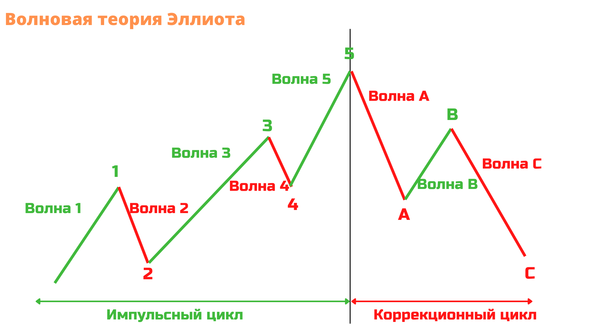

В волновой теории Эллиотта использует принцип вложенности волн. **Любая волна является частью более длинной волны**, и сама подразделяется на более короткие волны. Каждая волна разбивается на 3 или 5 волн. Это разбиение зависит от направления старшей волны частью которой являются младшие волны.
#### В чем заключается основной принцип в теории Эллиотта
Каждая **импульсная** волна состоит из **пяти волн меньшего размера**, а каждая волна **коррекции** (против тренда) - **из трех волн**.

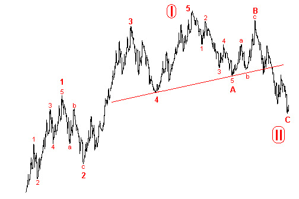

На рисунке Волна **1** состоит из **5** более мелких волн. Потому что она является импульсной волной, создающей тренд.

Самый длинный цикл согласно теории Эллиотта называется **большим суперциклом**. Он состоит из 8 волн суперцикла. Эти волны также состоят из 8 волн меньшего цикла и т. д.

На рисунке можно заметить пропорциональность волн импульса и следующих за ним волн коррекции. Чем сильнее волна импульса, тем сильнее волна коррекции, и наоборот. Сложность в волновой теории Эллиотта является идентификация волн. Обычно коррекционные волны очень трудно идентифицируются. 
#### Как определить волны
**Волна 1**
Начинается тогда, когда настроение рынка почти полностью медвежье. Новости по компании еще негативны. Обычно волна 1 - это сильный импульс. Например, смена медвежьего тренда на бычий, прорыв мощного уровня сопротивления и т. д. В спокойной ситуации показывает незначительное движение цен на фоне общей нерешительности.

**Волна 2**
Коррекционная по отношению к воле 1. Она начинается, когда рынок резко откатывается от недавнего роста. Откат может быть почти на 100% волны 1, но не ниже ее начала. Обычно составляет около 60% от волны 1. На рынке преобладают торговцы, закрывающие свои позиции т. к. фиксируют прибыль.

**Волна 3**
Импульсная волна. Из-за этой волны и живут приверженцы теории Эллиотта. Наблюдается резкий рост оптимизма среди инвесторов. Это наиболее мощная и длинная волна. Она никогда не может быть самой короткой. На ней происходит ускорение цен и увеличение объемов. Волна 3 превышает волну 1 по крайней мере в 1,618 раза и может быть даже больше.

**Волна 4**
Самая трудная для идентификации коррекционная волна. Обычно она откатывается не более, чем на 38% от волны 3. Ее глубина и длительность как правило не велики. Оптимистичные настроения все еще преобладают на рынке. Волна 4 не должна опускаться ниже начала волны 2. Часто в волне 4 можно увидеть графические фигуры треугольника, т. к. волне 4 присуща плоская коррекция.

**Волна 5**
Импульсная волна. Рост цен на средних объемах торгов. Проходит на фоне массового ажиотажа. К концу волны зачастую происходит резкий рост объемов торгов. На этой волне крупные игроки выходят из позиций и случается коррекция после.

**Волна А**
Первая импульсная волна в обратном направлении от тренда. Большинство продолжают считать, что рост скоро продолжится с новой силой. Но уже начали появляться игроки, убежденные в обратном. Характеристики этой волны часто очень похожи на волну 1.

**Волна В**
Похожа на волну 4 и очень трудна для идентификации. Показывает незначительное движение вверх на остатках оптимизма.

**Волна С**
Сильная импульсная волна на фоне общей убежденности о начале новой понижающей тенденции. Для нее типична высокая импульсность (пять волн) и растянутость до 1,618 раза от волны 3.

Волны Эллиотта хорошо просматриваются на истории графика, но довольно сложно определимы на будущее. Поэтому практическое использование волновой теории Эллиотта часто проблематично и требует специальных знаний и насмотренности. Существуют математические методы расчета волн, а также идентификация волн с помощью сетки Фибоначчи. 

>**Важно!** Для покупки ценных бумаг не стоит использовать только один сигнал. Обычно вывод о целесообразности входа в позицию делается, исходя из комбинации нескольких инструментов. То есть сделка совершается **по совокупности сигналов**.

При анализе ценной бумаги нужно рассматривать возможные варианты движения цены с примерными диапазонами движения. В этом помогают уровни, коррекция по Фибоначчи и волновая теория Эллиотта, которые мы разобрали в данной главе. А также индикаторы / осцилляторы, фигуры технического анализа и другие инструменты, которые изучаются далее.

---

### Какими бывают сделки или позиции на бирже

**Длинные позиции (Long)** открываются с целью заработать на повышении цены.

**Как это работает:**
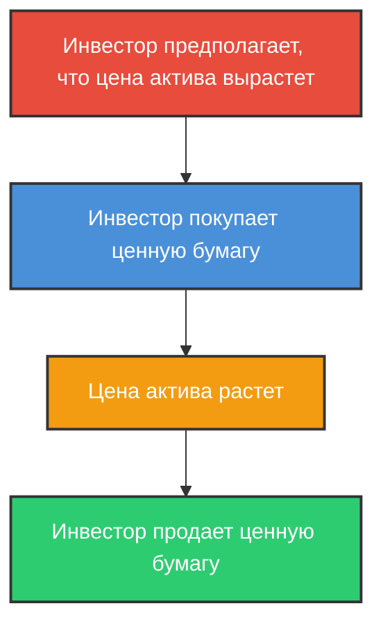
```mermaid
graph TD
    A[Инвестор предполагает, что цена актива вырастет ] --> B[Инвестор покупает ценную бумагу] --> C[Цена актива растет] --> D[Инвестор продает ценную бумагу]
    
    style A fill:#E74C3C,color:#fff,stroke:#333,stroke-width:2px
    style B fill:#4A90D9,color:#fff,stroke:#333,stroke-width:2px
    style C fill:#F39C12,color:#fff,stroke:#333,stroke-width:2px
    style D fill:#2ECC71,color:#fff,stroke:#333,stroke-width:2px
```

**Короткие позиции (Short)** открываются с целью заработать на понижении цены. Совершение таких сделок подразумевает использование ценных бумаг брокера, то есть инвестор берет их в долг.

**Как это работает:**
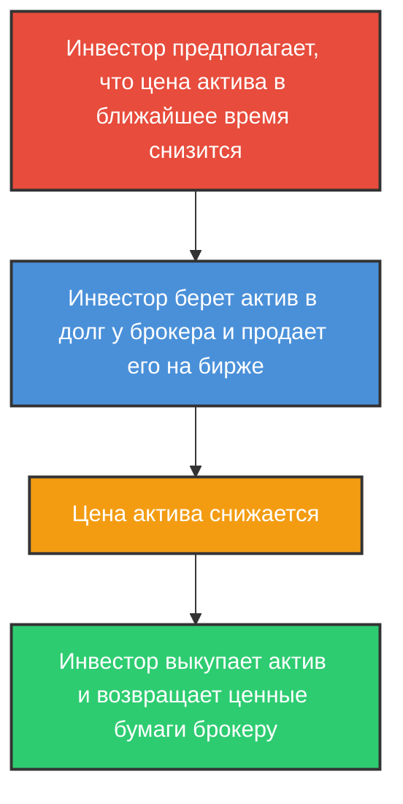
```mermaid
graph TD
    A[Инвестор предполагает, что цена актива в ближайшее время снизится ] --> B[Инвестор берет актив в долг у брокера и продает его на бирже] --> C[Цена актива снижается] --> D[Инвестор выкупает актив и возвращает ценные бумаги брокеру]
    
    style A fill:#E74C3C,color:#fff,stroke:#333,stroke-width:2px
    style B fill:#4A90D9,color:#fff,stroke:#333,stroke-width:2px
    style C fill:#F39C12,color:#fff,stroke:#333,stroke-width:2px
    style D fill:#2ECC71,color:#fff,stroke:#333,stroke-width:2px
```

>**Важно!** Открытие коротких сделок рискованно, потому что в качестве залога выступают средства инвестора. Любая ошибка может привести к значительным потерям. Также брокер возьмет комиссию за использование своих средств.

#### С помощью чего можно открыть позицию
- Рыночных заявок;
- Лимитированных заявок;
- Стоп-заявок;

**Рыночная заявка** исполнится без указания конкретной цены. Сделка пройдет по лучшей цене в момент поступления заявки на биржу. 

**Как это работает:**
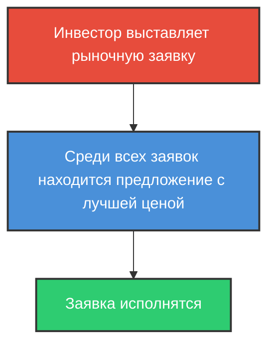
```mermaid
graph TD
    A[Инвестор выставляет рыночную заявку] --> B[Среди всех заявок находится предложение с лучшей ценой] --> C[Заявка исполнятся]
    
    style A fill:#E74C3C,color:#fff,stroke:#333,stroke-width:2px
    style B fill:#4A90D9,color:#fff,stroke:#333,stroke-width:2px
    style C fill:#2ECC71,color:#fff,stroke:#333,stroke-width:2px
```

>Рыночная заявка исполняется сразу же при условии достаточности средств на счете и ликвидности инструмента. По неликвидным инструментам заявка не исполнится потому что на рынке нет второго участника сделки.

Если на рынке недостаточное количество бумаг по одной цене, бумаги автоматически будут докуплены по цене, следующей за лучшей.

Если актив малоликвиден, а нужно купить большой объем бумаг, есть риск собрать существующие предложения по очень разным ценам с широким спредом. чтобы совершить такую покупку, лучше использовать **лимитированные заявки**.

**Лимитированная заявка** - совершается по указанной цене при оформлении заявки. Она позволяет покупать активы по конкретной цене в нужном количестве.

**Как это работает:**
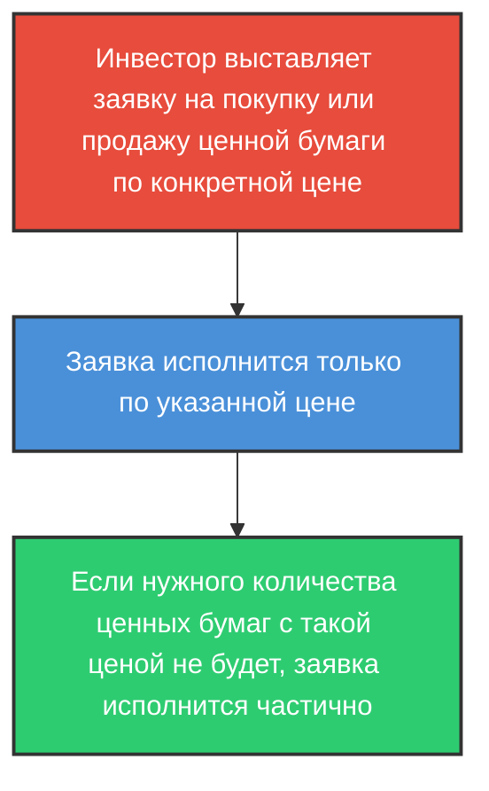
```mermaid
graph TD
    A[Инвестор выставляет заявку на покупку или продажу ценной бумаги по конкретной цене] --> B[Заявка исполнится только по указанной цене] --> C[Если нужного количества ценных бумаг с такой ценой не будет, заявка исполнится частично]
    
    style A fill:#E74C3C,color:#fff,stroke:#333,stroke-width:2px
    style B fill:#4A90D9,color:#fff,stroke:#333,stroke-width:2px
    style C fill:#2ECC71,color:#fff,stroke:#333,stroke-width:2px
```

**Стоп-заявки** предназначены для ограничения убытков и фиксации прибыли инвестора. Они бывают разных типов и их названия часто отличается у разных брокеров. Стоп-заявки отличаются от лимитных и рыночных заявок тем, что они отправляются на биржу при наступлении определенного условия.

---

### Какие есть основные виды стоп-заявок

**Стоп-лимит или stop loss** позволяет ограничить убыток по позиции или защитить текущую прибыль.

**Как это работает:**
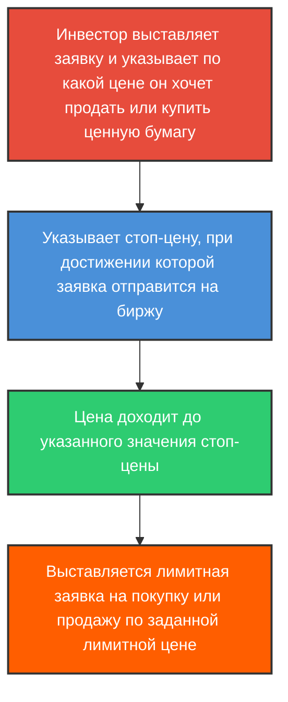
```mermaid
graph TD
    A[Инвестор выставляет заявку и указывает по какой цене он хочет продать или купить ценную бумагу] --> B[Указывает стоп-цену, при достижении которой заявка отправится на биржу] --> C[Цена доходит до указанного значения стоп-цены] --> D[Выставляется лимитная заявка на покупку или продажу по заданной лимитной цене] 
    
    style A fill:#E74C3C,color:#fff,stroke:#333,stroke-width:2px
    style B fill:#4A90D9,color:#fff,stroke:#333,stroke-width:2px
    style C fill:#2ECC71,color:#fff,stroke:#333,stroke-width:2px
    style D fill:#ff5e00,color:#fff,stroke:#333,stroke-width:2px
```

**Стоп-маркет или stop-market** похожа на стоп-лимит, но состоит только из указания стоп-цены. При достижении значений стоп-цены, заявка будет исполнена по рыночной цене. Рыночная цена может быстро меняться, поэтому сделка может пройти по непредсказуемой цене.

**Как это работает:**
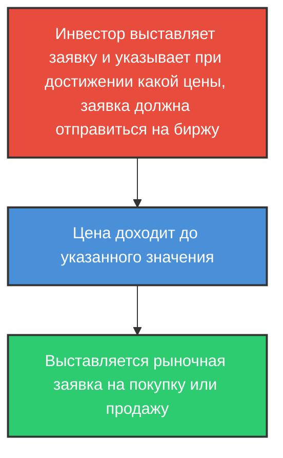
```mermaid
graph TD
    A[Инвестор выставляет заявку и указывает при достижении какой цены, заявка должна отправиться на биржу] --> B[Цена доходит до указанного значения] --> C[Выставляется рыночная заявка на покупку или продажу]
    
    style A fill:#E74C3C,color:#fff,stroke:#333,stroke-width:2px
    style B fill:#4A90D9,color:#fff,stroke:#333,stroke-width:2px
    style C fill:#2ECC71,color:#fff,stroke:#333,stroke-width:2px
```

**Тейк-профит или take profit** используется для фиксации прибыли при достижении указанной инвестором цены. Заявка не ограничена по времени. Однако при срабатывании тейк-профита ушедшая на биржу заявка будет активна до конца торговой сессии или до исполнения.

**Как это работает:**
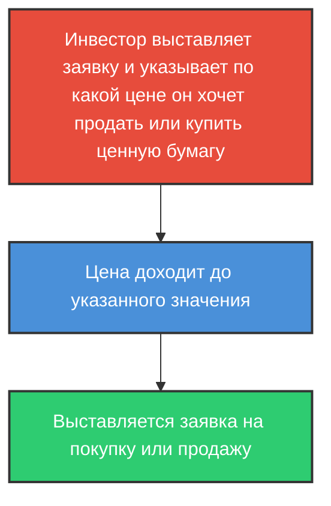
```mermaid
graph TD
    A[Инвестор выставляет заявку и указывает по какой цене он хочет продать или купить ценную бумагу] --> B[Цена доходит до указанного значения] --> C[Выставляется заявка на покупку или продажу]
    
    style A fill:#E74C3C,color:#fff,stroke:#333,stroke-width:2px
    style B fill:#4A90D9,color:#fff,stroke:#333,stroke-width:2px
    style C fill:#2ECC71,color:#fff,stroke:#333,stroke-width:2px
```

---

### Для чего нужен биржевой стакан

Биржевой стакан используется для анализа объемов спроса и предложения. Им могут пользоваться все инвесторы и трейдеры, независимо инвестируют ли они на долгосрок или занимаются краткосрочной торговлей.

**Биржевой стакан (level 2 на американском рынке)** - это таблица лимитных заявок (ордеров) на покупку или продажу конкретной ценной бумаги.

Все заявки инвестор с одной и той же ценой суммируются. Невозможно увидеть конкретно чью-то заявку в стакане т. к. они анонимны.

>**Важно!** В биржевом стакане отображаются только лимитные заявки. Другие типы заявок инвесторам / трейдерам не видны. Их может видеть только **маркетмейкер** в книге заявок.

Инвесторы могут найти в стакане важные уровни, на которых собралось большое количество заявок. От этих уровней логично совершать сделки по покупке или продаже.

Трейдерам же нужно быстро реагировать на изменения рынка и принимать решения по управлению открытой позицией. С помощью биржевого стакана они могут отслеживать движения ордеров в режиме реального времени и формировать свою торговую стратегию.

С помощью биржевого стакана можно оценить, насколько быстро получится продать актив по цене близкой к рыночной. То есть по стакану можно судить о ликвидности конкретного актива. Для оценки ликвидности нужно посмотреть на количество заявок и их плотность.

**Плотность заявки** - чем плотнее, тем больше заявок на каждом шаге цены.

**Шаг цены** - это минимально возможное изменение цены.

При высокой ликвидности разница в цене между строками будет совсем небольшой.

---

### Как читать биржевой стакан

Биржевой стакан может выглядеть по-разному и зависит от того, где его смотреть в терминале **QUIK** или приложении брокера.

**Примеры отображения стакана:**

  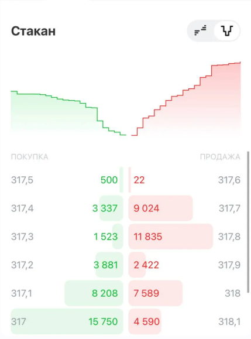
  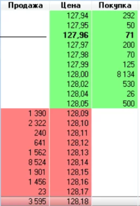

В примере слева таблица из двух столбцов. В первом находятся заявки на покупку или "биды" (bid - предложение) и их объемов (лоты, контракты). Во втором столбце отображаются заявки на продажу или "аски" (ask - спрос) и их объемов.

>Цены в столбце покупка (bid) сортируются по убыванию и выделены зеленым цветом.
>Цены в столбце продажа (ask) сортируются по возрастанию и выделены красным цветом.

В примере справа таблица из трех столбцов. Красные значения - это ордера на продажу, зеленые - на покупку.

В середине таблицы находятся самые низкие цены на продажу и высокие на покупку. Разница между лучшими заявками на покупку и продажу называется **спредом**.

Если бумага высоколиквидна, спред будет небольшим и составит копейки. Чем меньше ликвидность бумаги, тем больше будет спред.

>Чем ближе заявка к середине таблицы, тем ближе ее стоимость к рыночной цене. Чем дальше, тем выше разница в стоимости.

#### Как трейдеры используют биржевой стакан
Трейдер находит на графике цены значимый уровень - поддержки и сопротивления. С помощью стакана заявок он может оценить, что будет с ценой в следующий раз на этом уровне: пробьёт или отскочит от него.

Для этого он смотрит количество заявок и их объемов в районе цены значимого уровня. Если есть большое количество крупных заявок на покупку перед уровнем, то повышается вероятность пробоя этого уровня.

Если по активу видим краткосрочный нисходящий тренд, цена снижается. А позднее она внезапно начинает двигаться вверх, то трейдер может предположить - это разворот тренда или только коррекция. Если в биржевом стакане много заявок на продажу, то скорее всего восходящий тренд - это коррекция, и цена продолжит падать.
#### Какой вывод по биржевому стакану можно сделать
Биржевой стакан - торговый инструмент, с помощью которого можно видеть текущие заявки и цены других участников рынка в режиме реального времени. В стакане находятся лимитные заявки. Они размещаются предварительно, имеют четко определенные цены и количество лотов. Рыночные заявки в стакан не попадают.

Биржевой стакан помогает опытным инвесторам и трейдерам подтверждать наличие сильных уровней поддержки и сопротивления, ликвидность ценной бумаги. И определять, в каком направлении будет двигаться цена в ближайшее время. В сочетании с другими инструментами он поможет торговать более эффективно.

---
### Что такое маржинальная торговля и чем она опасна

**Маржинальная торговля или торговля с плечом** дает возможность совершать сделки с ценными бумагами и валютой без использования собственных средств или с их частичным использованием. Иными словами, **маржинальная торговля** - это торговля в кредит. Инвестор берет деньги или ценные бумаги в долг у брокера, залогом выступают имеющиеся у него активы.

**Пример:**
Инвестор хочет купить 100 лотов акций компании по цене 250 руб. за акцию. Для покупки нужно 25 000 руб., но у него есть только 10 000 руб. Инвестор может использовать маржинальные сделки и купить все 100 лотов, частично оплатив их занятыми у брокера деньгами. На счете свободных денег у инвестора будет минус 15 000 руб.

>Брокер дает в долг деньги и ценные бумаги с условием их возврата, залогом возврата выступают активы инвестора. За использование своих средств брокер берет плату - **комиссию**. То, что берется взаймы у брокера, называется **непокрытой позицией**.

>**Важно!** Сделки в режиме маржинальной торговли несут **повышенный риск**. При резком изменении цены в негативную сторону, сумма потенциальных убытков может быть больше, чем размер средств на счету инвестора. То есть можно **потерять все деньги и ценные бумаги**.

Для подключения маржинальной торговли *неквалифицированным* инвесторам нужно пройти обязательное тестирование. И еще обязательно знать, как рассчитывается сумма, которую дает брокер в долг.

**Начальная маржа** - это стоимость ликвидных активов на брокерском счете, умноженная на ставку риска для каждого из них. Если стоимость ликвидных активов ниже начальной маржи, инвестор не сможет открывать новые позиции.

**Ликвидные активы** - это общая стоимость свободных денег и ликвидных ценных бумаг на счете инвестора. Чем больше ликвидный портфель, тем больше денег или активов инвестор может занять у брокера.

**Ставка риска** - это минимальный процент, который необходимо обеспечить за счет собственных средств. Рассчитывается он от общей стоимости открываемой позиции.

С помощью ставки риска брокер рассчитывает обеспечение позиции. Это сумма, которая должна быть на счете для открытия и поддержания непокрытой позиции.

Чем ниже ставка риска, тем больше активов можно занять у брокера. С высокой же ставкой риска размер *плеча* в сделке будет небольшим или его не будет вовсе.

**Пример:**
У инвестора на счете 200 000 руб. Этих денег на задуманную инвестором сделку недостаточно, он берет в долг у брокера.  Ставка риска по приобретаемой бумаге 20%. Это значит, что 200 000 руб. могут обеспечить открытие позиции на сумму 1 млн руб.  Покупка на 200 000 руб. оплачивается собственными деньгами, а 800 000 руб. - сформируют непокрытую позицию.
После покупки цена акций выросла на 5%, и инвестор продал ценные бумаги.
*Финансовый результат инвестора*: 1 000 000 руб. х 5% = 50 000 руб.
*Если бы инвестор купил акции только на свои 200 000 руб.*: 200 000 руб. х 5% = 10 000 руб.

Имеющиеся на счете активы учитываются как лонг. А активы, проданные в шорт - как шорт. Ставки риска по лонгу и шорту могут отличаться. У рубля начальная и минимальная ставка риска равно нулю. Поэтому средства в рублях не учитываются при расчете начальной и минимальной маржи всего портфеля.

**Минимальная маржа** - это половина от начальной маржи. Стоимость ликвидных активов на счете может быть ниже минимальной маржи. Это значит, уровень долга критичный, что может привести к **маржин-колу**.

**Маржин-колл (margin call)** - предупреждение брокера о необходимости увеличения залога или закрытии части кредитных позиций. Если не последовать рекомендации, брокер закроет позиции принудительно.

В этом случае брокер может закрыть не только непокрытые позиции, но и продать другие активы на счете инвестора. Деньги от продажи активов останутся на брокерском счете инвестора и будут снижать значения его начальной и минимальной маржи. 