На фондовом и срочном рынках инвестор принимает решения в условиях неопределенности. Он не знает точно, что будет в будущем. И может только продумать сценарии развития событий и ориентироваться на то, что было в прошлом.

Не существует безопасных инвестиций, все активы несут определенные риски для инвестора.

>**Риск** - вероятность того, что результат инвестиций будет отличаться от ожидаемого.

Если **риск реализуется**, инвестор может:
- Получить доход меньше планируемого;
- Потерять часть вложенных денег;
- Потерять все вложенные деньги;

Все риски несет **сам инвестор**, поэтому для него так важно уметь определять степень рисков и управлять ими. Доходность всегда связана с уровнем риска. Чем выше потенциальная доходность ценной бумаги, тем выше риски по ней.

|Инструмент|Риск (1–10)|Доходность (1–10)|Позиция|
|---|---|---|---|
|Государственные облигации|2|2|🔵 Низкий риск, низкий доход|
|Корпоративные облигации|4|4|🟢 Умеренный риск, доход|
|БПИФы и ETF|6|6|🟡 Средний риск, доход|
|Акции|8|8|🟠 Высокий риск, высокий доход|
|Фьючерсы и опционы|9|9|🔴 Очень высокий риск, спекулятивный доход|

Наиболее рисковыми для инвесторов считаются инструменты срочного рынка - **фьючерсы и опционы**, наименее - **государственный облигации**. У каждого инструмента свои риски, которые вы изучите в следующих главах. Для начала разберемся, с какими рисками сталкивается инвестор на фондовом рынке.

---

### Какие риски существуют на рынке ценных бумаг

Рисков в инвестициях много, их можно разделить на разные категории в зависимости от признака, взятого для классификации. 

Выделим **2 основные группы рисков**:
- **Общие или систематические риски** - это общие риски вложений в ценные бумаги, их еще называют рыночными рисками. Они не связаны с конкретными эмитентами или финансовыми инструментами. Рыночный риск сложно просчитать и предсказать, он не диверсифицируется и не понижается. Инвестор не может влиять на факторы рыночных рисков, они не зависят от него.
- **Специфические или несистематические риски** - характерны для конкретного эмитента, сектора или отрасли. Их можно назвать индивидуальными. Эти риски можно снизить за счет включения в портфель инструментов с меньшим уровнем риска, то есть на него можно влиять.

**Классификация инвестиционных рисков**
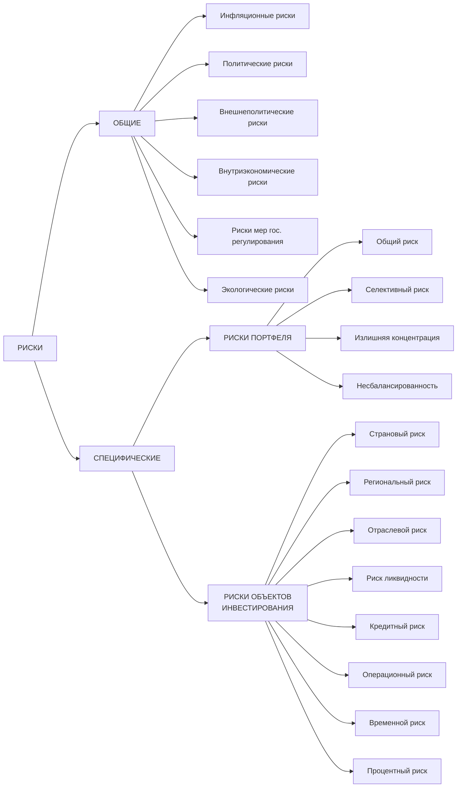

---

### Что относят к общим или систематическим рискам

**Инфляционные риски** подразумевают, что доход от инвестиций не покроет расходов инвестора из-за влияния инфляции. 

**Политические риски** связаны с возможными изменениями в политической структуре государства и влиянием их на финансовый рынок. Политическая нестабильность, смена государственного лидера и т. д.

**Внешнеэкономические и внутриэкономические риски** связаны с внешнеэкономической и внутриэкономической деятельностью страны соответственно.

**Риск мер государственного регулирования** связаны с изменением законов, вводом ограничений со стороны государства, изменения государственного регулирования и т. д.

**Экологические риски** связаны с возможными потерями из-за ухудшения экологической обстановки или природных катастроф.

---

### Что относят к специфическим или несистематическим рискам

#### Риски портфеля:
**Общий или капитальный риск** подразумевает анализ необходимости портфельного инвестирования. Иногда бывают ситуации, когда деньги безопаснее вложить в другие активы. Например, если срок инвестирования несколько месяцев, безопаснее рассмотреть вклады.

**Селективный риск** или риск неправильного выбора ценных бумаг связан с тем, что инвестор вкладывает деньги в неверно оцененные инструменты. Из-за отсутствия знаний или неправильного анализа данных в портфель могут попасть ценные бумаги, которые на самом деле не являются перспективными в плане получения дохода.

**Риск излишней концентрации** или недостаточной диверсификации связан с высокой концентрацией в портфеле определенных активов. Когда инвестор покупает только 1-2 ценные бумаги, снижение их цены приведет к большим убыткам. 

**Риск несбалансированности** подразумевает, что в портфеле инвестора нет баланса вложенных в активы средств. Чего-то куплено больше, а чего-то меньше - все это ведет к дисбалансу, который может привести к убыткам.
#### Риски объектов инвестирования:
**Страновые риски** связаны с возможными потерями при инвестировании в активы разных стран. Они складываются из совокупности экономических, политических, географических и других рисков страны-эмитента. Потери могут быть вызваны решениями руководства страны, ухудшением экономической обстановки в ней, высоким уровнем инфляции в стране и т. п.

**Региональные риски** связаны с экономическими рисками конкретного региона эмитента.

**Отраслевые риски** отражают вероятность потерь денег из-за изменения ситуации в конкретной отрасли экономики.

**Риск ликвидности** связан с потерями при продаже ценной бумаги из-за отсутствия желающих ее купить. Если нет покупателей на ценную бумагу, продавец вынужден снижать цену для привлечения покупателей.

**Кредитный риск** связан с невозможностью исполнения своих обязательств эмитентов, когда он не может выплатить проценты или погасить свой долг.

**Операционный риск** вызван скорее техническими моментами. Потери связаны со сбоями в программном обеспечении, недостаточной квалификацией персонала и т. д. Иногда операционные риск срабатывает из-за человеческого фактора - ошибки и небрежности сотрудников.

**Временной риск** связан с потерями из-за неверного определения моментов покупки или продажи ценных бумаг.

**Процентный риск** связан с возможным снижением дохода из-за изменения процентных ставок. Повышение или понижение учетной ставки влияет на стоимость ценных бумаг и отражается на доходах инвесторов.

Отдельно можно выделить **инфраструктурные риски**, которые связаны:
- С несовершенством правовой структуры рынка, когда нарушаются правила его участниками;
- С неисполнением обязательств участниками рынка, в том числе эмитентов или управляющих компаний;
- С неожиданными и негативными изменениями в регулировке фондового рынка;

Недостаточно оценить какой-то один риск, нужно оценивать их совокупность. На риски можно и нужно влиять, это поможет привести доходность портфеля к желаемой. Каждый вид ценных бумаг всегда связан с общими и конкретными неспецифическими рисками.

---

### С какими рисками связаны инвестиции в акции

1. **Резкое падение цены акций на фоне новостей / событий**
	Иногда новости или происшествия приводят к резкому снижению цены. Обычно это негативные события, которые могут повлиять на бизнес. Инвесторы начинают продавать акции, что приводит к падению их стоимости.

2. **Длительное восстановление стоимости акций после падения**
	Примером являются акции Магнита. С 2017 года цена упала более чем на 65% и на сегодняшний день не восстановилась до максимальных значений. Поэтому инвестировать в акции на короткие сроки (1 - 3 года) не рекомендуется.
	

3. **Пересмотр дивидендной политики в сторону уменьшения дивидендов или отказа от выплат**
	Длительное время Татнефть славилась щедрой дивидендной политикой. Однако в 2020 году на фоне пандемии компания изменила выплаты. Этот факт и общая негативная обстановка на рынке повлияли на настроение инвесторов. Стоимость акций ощутимо снизилась.

4. **Банкротство компании или уход с биржи**
	Почти все компании берут в долг, но некоторым их них сложно справляться с выплатой кредитов. Компании с высокой кредитной нагрузкой могут обанкротиться, а их акционеры потеряют свои вложения. В случае банкротства компании интерес к бумагам резко падает. Инвесторы стремятся получить хоть что-то до начала процедуры и продают акции. Что приводит к значительному снижению цены.

5. **Изменение ставки центрального банка**
	Повышение процентных ставок может привести к снижению стоимости акций. Это происходит, потому что инвесторы начинают фиксировать прибыль и покупать облигации, открывать вклады. В период повышения ставок их доходность увеличивается, а рисков они несут меньше, чем акции.

6. **Валютные риски**
	Касаются акций, выпущенных в валюте. Если инвестор покупает акции в валюте, он зарабатывает на росте цены акции и на росте валюты. Снижение курса валют может привести к уменьшению дохода инвестора и даже убыткам.

---

### Как снизить риски потерь по акциям

1. **Выбирать качественные и надежные компании с помощью фундаментального анализа и анализа новостей**
	Инвестору важно оценить бизнес компании и его перспективы. Если у компании много долгов, а бизнес не приносит прибыли - она может обанкротиться или перестать платить по долгам. Это сразу приведет к падению цены акций. Инвесторы не захотят покупать ценные бумаги компании с финансовыми проблемами.

	Если же компания хорошо зарабатывает, участвует в перспективных проектах, то это повышает интерес инвесторов и отражается на цене акций.

	Недостаточно один раз выбрать компанию и забыть про неё. Экономическая обстановка и разные события влияют на бизнес, поэтому он может переживать взлеты и падения. Инвестору нужно следить за компанией и периодически оценивать ее работу.

2. **Включать в портфель акции компаний их разных секторов, стран и в разных валютах, то есть диверсифицировать его**
	Когда в портфеле одна или две акции, то портфель зависит только от их цены. Растет цена - растет весь портфель, снижается цена - снижается стоимость всего портфеля. Так как доля акций высокая, то и падение в этом случает будет глубоким.

	Если в портфель включить разные акции, это снижает долю каждой из них. Цены акций из разных секторов зависят от многих факторов, которые часто не пересекаются. При наступлении этих факторов одни акции падают в цене, а другие растут и компенсируют снижение цены.

3. **При выборе акций обращать внимание на зависимость их доходности от рыночной. В этом инвестору помогает коэффициент бета (β)**
	Коэффициент бета (β) показывает, как цена акции реагирует на изменения рынка, на сколько она чувствительна к этим изменениям.

	**Пример**
	Коэффициент β компании равен 3. Что это значит? Если весь рынок упадет на 1%, акция снизится в цене на 3%.

	Бета-коэффициент используется инвесторами для оценки рисков и потенциальной доходности.

	Какие **минусы** есть у бета-коэффициента:
	- Коэффициент рассчитывается из исторических данных, а прошлые данные не гарантируют повторения в будущем;
	- Коэффициент не учитывает новостной фон, изменения в структуре компаний, её финансовые показатели;

	Считать бету инвестору самостоятельно не нужно. Ее значение можно найти на скринерах. Выбирать компании **только** по бета коэффициенту не рекомендуется, это лишь дополнительный фактор выбора.

---

### Разделение акций по характеристикам

#### 1. Blue-chip stock или голубые фишки

Эмитенты акций - хорошо известные, крупные и зарекомендовавшие себя организации. Высокая прибыль таких компаний позволяет им стабильно выплачивать дивиденды. Темны развития компаний не слишком высокие, но и не низкие. Можно сказать, что ни развиваются в едином с экономикой темпе.

**Подходят инвесторам**:
- Не готовым к риску;
- Предпочитающим стабильные дивиденды;

Бета акций находится в диапазоне 0.85-1.
	

#### Пример портфеля из голубых фишек

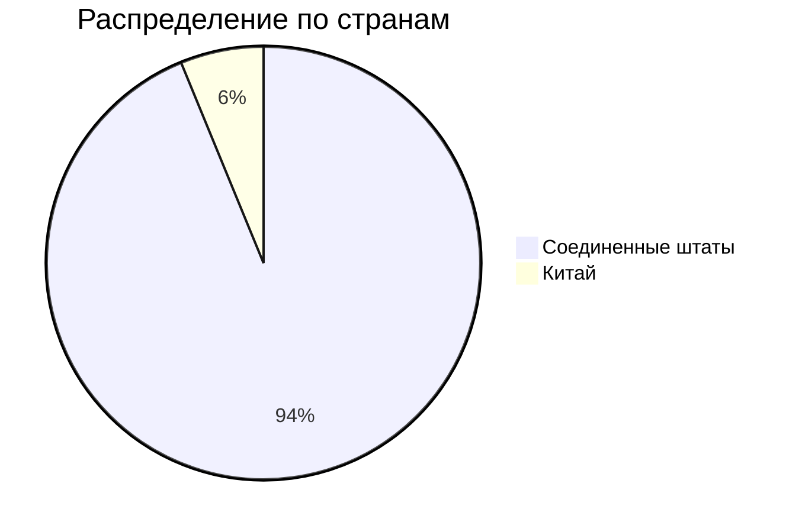
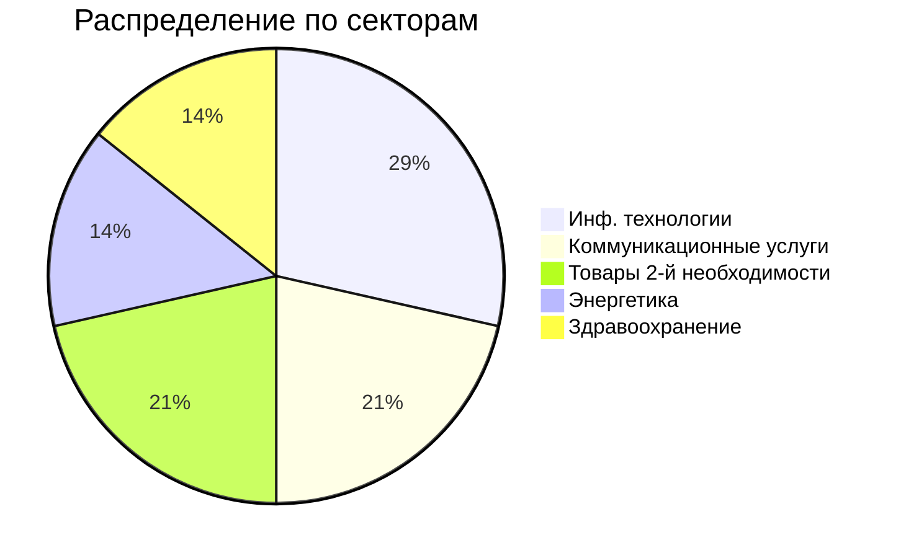

#### 2. Grow stock или растущие компании

Эмитенты акций - компании, которые активно растут. Темпы развития компаний выше темпов экономики. Почти вся прибыль реинвестируется в бизнес, поэтому компании платят маленькие дивиденды или не платят их.

**Подходят инвесторам:**
- Готовым вложить средства в рисковые компании и заработать на волатильности;
- Готовым к маленьким дивидендам или вовсе отказаться от них;

Бета акций больше 1.3

**Пример портфеля акций роста**

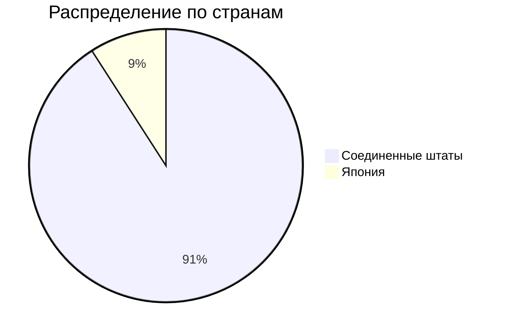
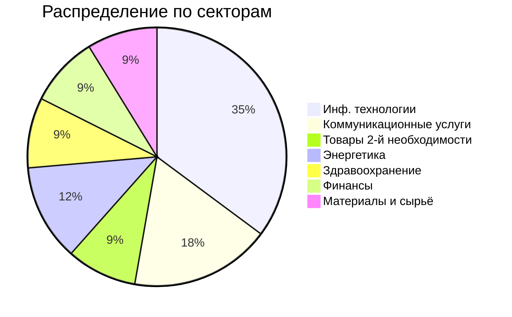
#### 3. Cyclical stock или цикличные акции

Результаты эмитентов зависят от стадии экономического цикла. В период роста экономики результаты компании улучшаются, а в период спада - снижаются.

**Подходят инвесторам:**
- Готовым вложить средства в рисковые компании и заработать на волатильности;
- Готовым к маленьким дивидендам или вовсе отказаться от них;

Бета акций больше 1.2

**Пример портфеля циклических акций**

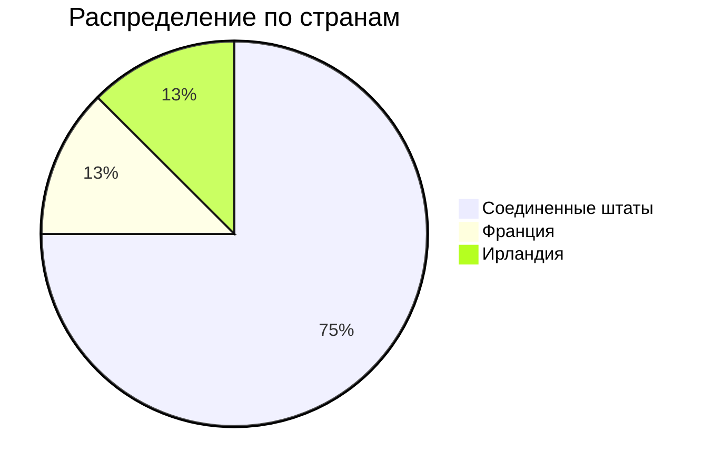
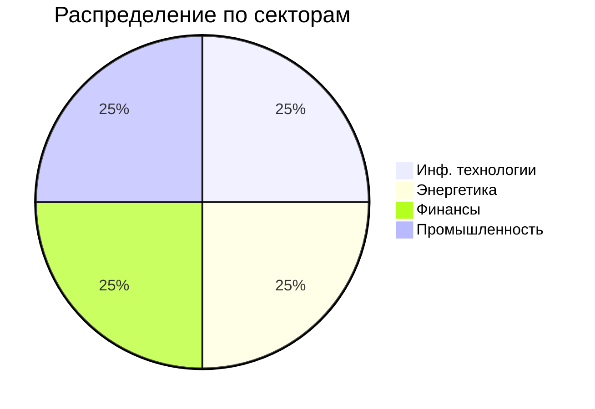
#### 4. Defensive stock или защитные акции

Компании мало зависят от стадии экономического цикла. Из-за стабильных доходов компании выплачивают стабильные дивиденды, а цена акций мало изменчива.

**Подходят инвесторам:**
- Не готовым к риску;
- Предпочитающим стабильные дивиденды;

Бета акций меньше или в районе значения 0.9

**Пример портфеля защитных акций**

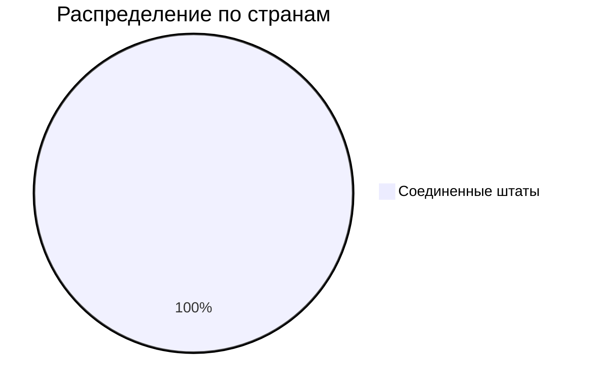
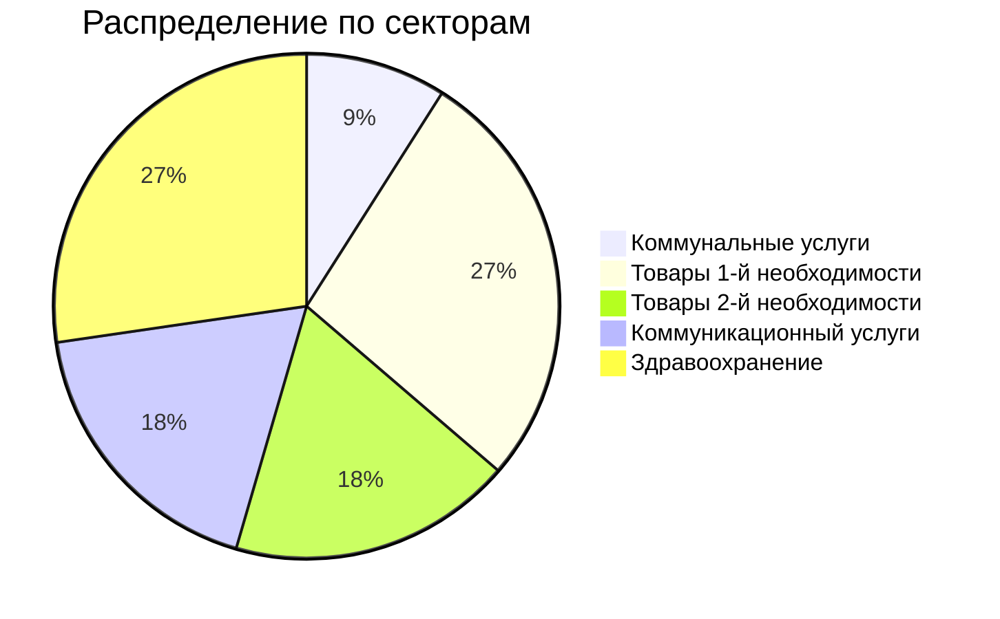
#### 5. Speculative stock или спекулятивные акции

Эмитенты акций - компании, занимающиеся новыми технологиями, которые еще только входят в жизнь людей. Из-за новизны продукта у компаний нет стабильных доходов, но они могут появиться в будущем. Бизнес таких компаний может оказаться как прорывным, так и провальным.

**Подходят инвесторам**, готовым к высокому уровню риска.

Бета акций больше 1.5

Комбинируя разные типы акций в портфеле, инвестор может управлять его рисками. Чем больше акций с бета коэффициентом выше 1, тем выше потенциальная доходность и риски убытков.

**Пример портфеля спекулятивных акций**

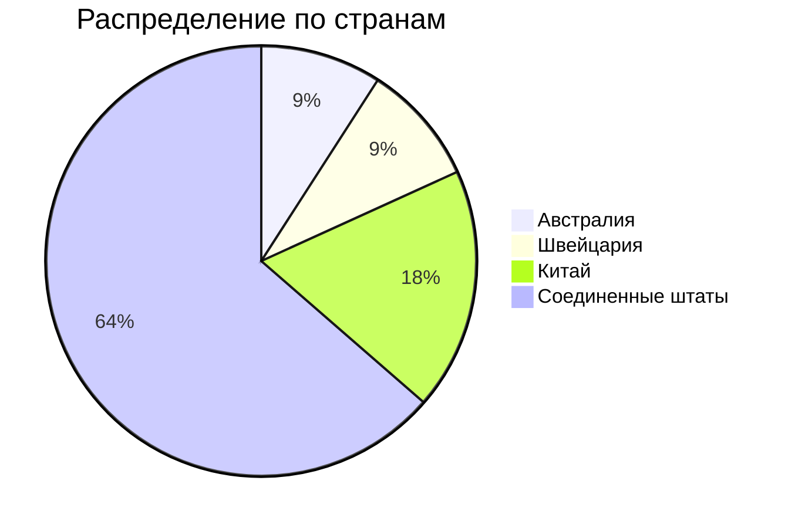
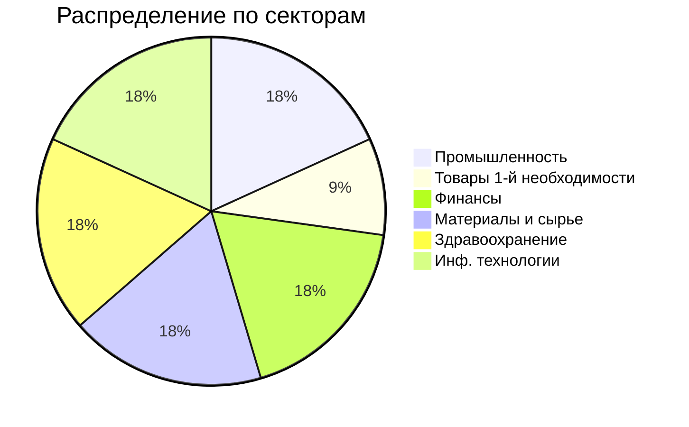

