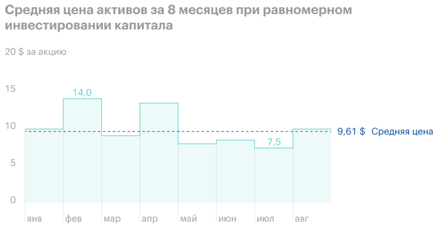
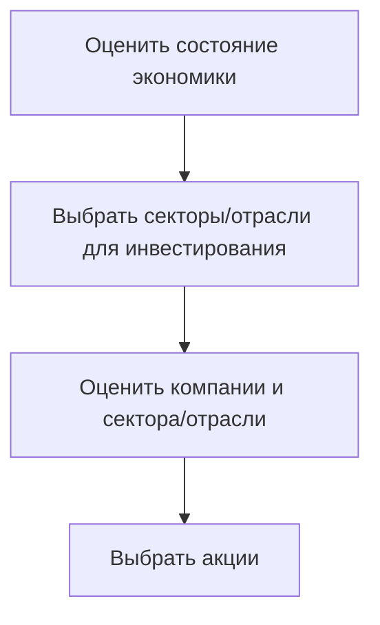
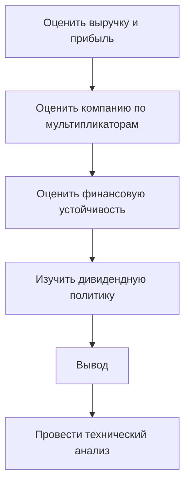

**Стратегия инвестирования** - это план покупок и продаж ценных бумаг.

Стратегия зависит от:
- Цели инвестирования;
- Сроков инвестирования;
- Отношения инвестора к риску;
- Других факторов;

Благодаря стратегии инвестор:
- Понимает, что делать в периоды падения или роста рынка;
- Знает, какие ценные бумаги выбирать в портфель;
- Умеет управлять портфелем;

>У каждого из инвесторов свои цели, индивидуальные особенности и возможности. Поэтому и стратегии инвестирования отличаются. Рассмотрим самые популярные из них.

---

### Стратегия 1. Купи и держи 

**Что делает инвестор**: покупает акции компаний с высоким потенциалом роста цены на длительном горизонте. Стратегия подразумевает, что акции будут в портфеле до момента, пока они не достигнут поставленной цели.

**Особенности стратегии**: при кажущейся лёгкости стратегия не из простых. Она требует от инвестора умения прогнозировать тренды и перспективы рынка. Недостаточно купить акции и забыть о них. Инвестор должен выбрать надежные и качественные компании с потенциалом. Портфель требует регулярного внимания, анализа компаний, ребалансировки и покупки акций.

**Минусы стратегии**:
- Регулярный мониторинг портфеля;
- Риск убытков из-за неверной оценки акций;
- Некоторые прогнозы не реализуются из-за внешних факторов;
- Нужно уметь *пересидеть* моменты просадок;

**Пример**:

>Первоначальный капитал, который выделен на акции - 1000$.
>Срок инвестирования 12 лет.
>Риск-профиль инвестора агрессивный.
>Стратегия "Купи и держи".

Важно распределить 1000$ между акциями компаний из разных стран, секторов экономики и выпущенных в разных валютах. Требуется выбрать компании, которые соответствуют требованиям инвестора. Обычно это крупные, устойчивые и перспективные компании.

После этого нужно провести детальный анализ компаний из разных секторов.

На первых этапах формирования портфеля часто на каждый сектор выделяют примерно одинаковое количество денег. При следующих пополнениях добавляются акции компаний из других секторов и докупаются уже имеющиеся ценные бумаги. 

*Важно соблюдать пропорции и не допускать слишком больших долей отдельных секторов или компаний.*

---

### Стратегия 2. Дивидендная

**Что делает инвестор**: покупает акции компаний, которые стабильно выплачивают дивиденды.

**Особенности стратегии**: основной доход инвестору приносят дивиденды. Инвестор должен ориентироваться на компании с регулярными выплатами, а не разовыми. При выборе компаний нужно изучить дивидендную политику, историю выплат и их источник. Негативным фактором будет выплата больших дивидендов за счет кредитных денег или необоснованный рост дивидендов.

**Минусы стратегии**: 
- В условиях кризиса размер дивидендов может уменьшится;
- Дивидендные компании обычно плохо растут в цене;
- Выплата дивидендов по некоторым компаниям происходит 1-2 раза в год;
- Есть риск изменения дивидендной политики или отказа от выплат;

Для стратегии идеально подходят дивидендные аристократы из разных стран. При формировании портфеля важно также не забывать о диверсификации по секторам.

>Агентство *Standard & Poor's* рассчитывает индексы, в которые входят дивидендные аристократы разных стран:
>	- США - SPDAUDT - S&P 500 Dividend Aristocrats
>	- Европа - SPDAEET - S&P Europe 350 Dividend Aristocrats

Для поиска компаний, которые стабильно выплачивают дивиденды, можно использовать эти индексы или посмотреть на показателя компании:
- DSI больше 0.6;
- DPR 30-70%;

>**Важно!** В 2022 году многие российские компании отказались от выплат дивидендов. А дивиденды по иностранным акциям не попадают на счета российских инвесторов из-за санкций.

---

### Стратегия 3. Стратегия усреднения стоимости

**Что делает инвестор**: постепенно покупает акции по плану вне зависимости от ситуации на рынке или при достижении конкретной цены.

**Особенности стратегии**: суть стратегии не в том, чтобы купить акции *на дне*, а сладить повышенную волатильность рынка. Как и любая стратегия требует использование фундаментального анализа. Для определения оптимальных точек входа инвестор может использовать технический анализ. При покупках важно следить за долей компании в портфеле. Если инвестор увлечется, он может превысить выделенную долю. И это приведет к дисбалансу портфеля.

**Минусы стратегии**:
- Требует дисциплинированности и иногда отключения эмоций;
- Нужно регулярно совершать сделки, что требует наличия денег;
- Не сработает на заведомо убыточных акциях;

---

### Стратегия 4. Инвестирование в недооцененные акции

**Что делает инвестор**: покупает акции компаний, которые на рынке стоят меньше их реальной стоимости.

**Особенности стратегии**: требуется знания фундаментального анализа и умения анализировать компании с помощью коэффициентов и мультипликаторов. Благодаря знаниям инвестор выделяет недооценённые компании. И покупает их - в надежде, что на длительном горизонте рыночная цены вырастет. 

**Минусы стратегии**:
- Поиск и отбор акций требуют много времени;
- Иногда акции не растут в цене по объективным причинам. Компания может быть заведомо убыточной, поэтому инвесторы и не проявляют к ней интереса;
- Цена акции может не вырасти или расти долго, потому что рынок непредсказуем;

Недооцененными компаниями могут быть как крупные и устойчивые, так и совсем молодые, порой даже убыточные. Второй вариант связан с высокими рисками, поэтому часто акции подобных компаний включают в тактическую часть портфеля.

---

### Стратегия 5. Индексная

**Что делает инвестор**: покупает акции входящие в состав индексов.

**Особенности стратегии**: в индексы входит большое число акций, что обеспечивает хорошую диверсификацию. Но по той же причине повторить индекс частному инвестору сложно. Большинство инвесторов используют для этой стратегии инвестиционные фонды, которые доступны в цене и не требуют регулярного внимания.

**Минусы стратегии**:
- Сложно самостоятельно повторить индекс;
- При инвестировании напрямую в акции требует большого капитала;
- Нужно постоянно проводить ребалансировку для соответствия портфеля индексу;

---

### Стратегия 6. Инвестирование в компании крупной капитализации

**Что делает инвестор**: покупает акции с большой рыночной капитализацией.

**Особенности стратегии**: компании крупной капитализации обычно надежные и зарекомендовавшие себя. Также часто платят дивиденды и несут меньше рисков для инвестора.

**Минусы стратегии**;
- Рыночная капитализация постоянно меняется;
- Крупная капитализация не гарантирует хорошие финансовые показатели компании;

---

### Стратегия 7. Трендовая 

**Что делает инвестор**: покупает акции, которые популярны среди инвесторов, в надежде, что они продолжат свой рост.

**Особенности стратегии**: инвестор выделяет на рынке акции, которые быстро растут в цене и вероятнее всего будут расти дальше. Сделки носят скорее спекулятивный характер, но в некоторых случаях акции могут покупать и на долгий срок.

**Минусы стратегии**:
- Высокие риски из-за смены трендов;
- Популярность у инвесторов не всегда имеет финансовые обоснования;

Стратегия может быть и комбинированной, когда в одном портфеле используются несколько стратегий одновременно. Такой подход позволит инвестору обойти минусы каждой из стратегий и найти оптимальную золотую середину для своих накоплений.

---

### Как выбрать акции

Каждый начинающий инвестор теряется, когда дело доходит до выбора ценных бумаг. В этом уроке вы узнаете про основные этапы отбора и попробуете выбрать акции в свой портфель.

**Отбор акций проходит в несколько этапов:**

**1. Оценить экономику и макроэкономические показатели**

На этом этапе инвестор анализирует макроэкономические показатели страны и в мире. В результате он определяет перспективные для инвестирования сектора и отрасли и переходит к непосредственно отбору акций. 

>Как проводить анализ экономики, вы узнаете в Блоке 2.

**2. Оценить и выбрать компанию-эмитента**

При всем многообразии компаний в портфель нужно выбрать только несколько из них. В этом инвестору помогают сайты-помощники, которые называются **скринерами**. В них можно найти информацию о финансовых операционных результатах компаний, рассчитанные мультипликаторы и коэффициенты.

---

### Как проанализировать компанию

После составления списка претендентов, можно переходить к их оценке и поиску лучших.

#### → Оценить размер и динамику показателей выручки и прибыли

**Что нужно изучить**:
- Выручка;
- Чистая прибыль;
- Прибыль на акцию или EPS;
- EBITDA;

Анализируются данные на протяжении последующих пяти лет. Важно обратить внимание **на темпы роста** выручки и прибыли. Привлекательными для инвестора выглядят компании с стабильно растущими выручкой, прибылью и EBITDA. Если показателя снижаются, нужно понять причины.

Размер и темпы роста прибыли нужно соотнести с объемами и темпами роста выручки:
- Снижение прибыли на фоне роста выручки говорит, что компания по каким-то причинам увеличила расходы;
- Снижение выручки на фоне роста прибыли говорит об увеличении неоперационных доходов, которые не связаны с основной деятельностью компании.

Выручка, прибыль и EBITDA могут снижаться и из-за кризисов. Например, в пандемию многие компании останавливали или снижали производства, что отразилось на показателях. В таких случаях оценивают как быстро цифры вернулись к докризисным.

Коэффициент EPS тоже анализируется в динамике. Он показывает, сколько прибыли получит инвестор на каждую акцию. Если динамика положительная - значит компания наращивает свои доходы. Еще одной причиной роста EPS может быть сокращение числа акций, что не связано с ростом чистой прибыли.

>На этом этапе можно отметить для себя компании с положительной динамикой показателей на протяжении нескольких лет.

#### → Изучить мультипликаторы, коэффициенты и прочие показатели

**Что нужно оценить**:
- P/E, P/B, P/S;
- EV/EBITDA, ROA, ROE;

Мультипликаторы и коэффициенты оценивают финансовые показатели компании.
Их сравнивают с данными конкурентов и средними по отрасли. Такой подход позволяет выделить компании с лучшими показателями.

При оценке мультипликаторов и коэффициентов важно не забывать о выбранной стратегии и включить бумаги, которые подходят для неё.

Акции обычно делят на:
- Акции стоимости;
- Акции роста;
- Дивидендные акции;

#### → Оценить долговую нагрузку и платежеспособность компании

- Динамика чистого долга;
- L/A, Чистый долг/EBITDA;
- Коэффициенты текущей, срочной, абсолютной ликвидности;

Практически у любой компании есть кредиты и другие обязательства. Это не делает компанию хуже, потому что кредиты - источник средств для развития. Чем больше денег вкладывается, тем больше будет отдача от них. При использовании кредитов важно, чтобы компания справлялась со своими долгами и сохраняла платежеспособность.

**Пример**:

>Василий получает 100 000 руб. в месяц. На оплату коммунальных услуг, питания, развлечения и т.п. у него уходит в районе 50 000 руб. Также у Василия есть кредиты, по которым он суммарно платит 50 000 руб. в месяц. Зарплаты Василия вполне хватает, чтобы ни в чем себе не отказывать и выплачивать долги.
>Василий попал под сокращение и поменял работу. Зарплата на новом месте составляет 70 000 руб. в месяц. Размер дохода изменился, а ежемесячный платеж по кредитам - нет. Василий также должен платить 50 000 руб. Теперь зарплаты Василия недостаточно для оплаты долга и минимальных жизненных трат, его платежеспособность снизилась.

При наращивании долгов нужно разобраться, куда уходят деньги. Если деньги тратятся на бизнес - то нужно ждать, что они вернуться увеличенными с прибылью. Однако на это потребуется время. Если вложения вероятнее всего не принесут деньги компании (тратятся на выплату дивидендов, погашение старых долгов и т. п.), это может ухудшить ее финансовую устойчивость.

Коэффициенты долговой нагрузки и платежеспособности позволяют инвестору увидеть, не тяжело ли компании платить по долгам, достаточно ли денег она зарабатывает. Оценивается не только платежеспособность - но и то, как быстро компания при необходимости сможет расплатиться с кредитами.

#### → Для инвесторов с пассивными стратегиями важно оценить дивидендные выплаты

- Дивидендной доходности;
- DPR;
- DSI;

Недостаточно просто сравнить показатели и отметить лучших, нужно еще изучить дивидендную политику. Её описание и условия изменения можно найти на официальных сайтах компаний. Иногда дивидендная политика принимается на ограниченный срок или её условия зависят от финансовых показателей компаний. Все это должен знать и учитывать инвестор.

Привлекательнее выглядят эмитенты со стабильными дивидендами, размер, которых постепенно увеличивается. Ориентироваться на разовые высокие дивидендные доходности долгосрочному инвестору не стоит. Компании, которые 1-2 раза выплатили большие дивиденды, чаще всего не повторяют такие выплаты.

