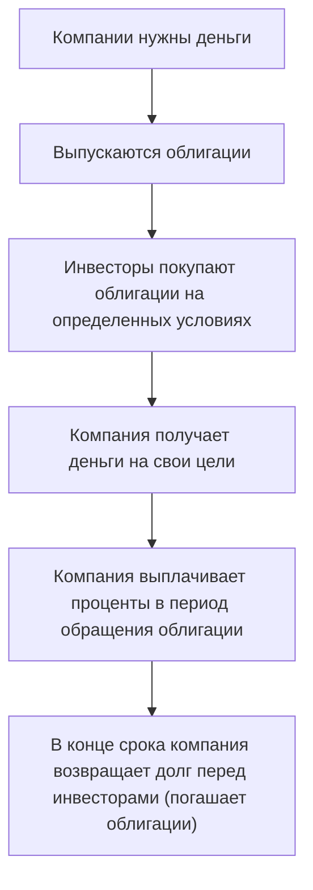
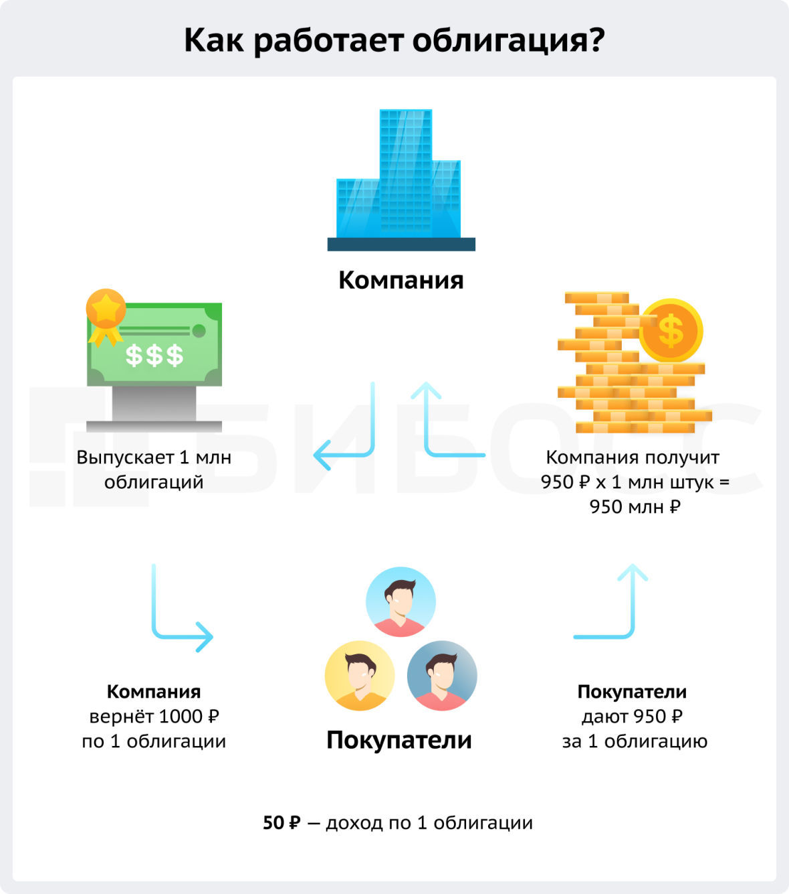
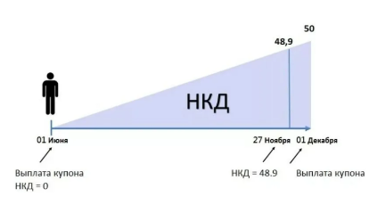

Облигации относят к долговым ценным бумагам. Она подтверждает, что владелец облигации предоставил заем лицу, которое выпустило облигацию.

>**Облигация (bond)** - это эмиссионная ценная бумага. Она закрепляет право её владельца на получение от эмитента в предусмотренный срок облигации её номинальной стоимости.

Облигация подтверждает, что владелец дал компании в долг. И теперь имеет право получить его возврат - и проценты за пользование деньгами.

Компании нужны деньги → Выпускаются облигации → Инвесторы покупают облигации на определенных условиях → Компания получает деньги на свои цели → Компания выплачивает проценты в период обращения облигации → В конце срока компания возвращает долг перед  инвесторами (погашает облигации).

**Почему компании выпускают облигации**
Компаниям для развития нужны деньги. Они могут использовать средства, которые заработали самостоятельно. Но чаще используют и заёмные. Использование кредитов позволяет быстрее достичь нужных результатов. Больше вложений - больше отдача.

Взять деньги в долг компания может разными способами - чаще всего это кредиты в банках. Однако не всегда компаниям дают кредиты, а их условия могут оказаться невыгодными. Часто с помощью облигаций компании удается привлечь больше денег под более выгодные для нее условия.

**Кто может выпуска облигации**:
- Государство;
- Муниципальные органы власти;
- Региональные органы власти;
- Компании;

---

### Как выпускают облигации

Выпуск облигаций и их обращение строго регламентируется законодательством. Можно выделить следующие этапы **эмиссии облигаций**:

1. **Предварительный этап** - На этом этапе прорабатывается концепция эмиссии. Компания должна сформулировать почему она берет в долг, куда планирует инвестировать, какие планы по собственному развитию, кто будет заинтересован купить выпущенные облигации.
2. **Решение о выпуске облигаций** - Совет директоров или акционеры принимают решение о начале выпуска облигаций. Если решение положительное, его публикуют в прессе.
3. **Утверждение решения о выпуске** - Компания утверждает решение о проспекте эмиссии и выпуске облигаций.

>**Проспект эмиссии** - официальный документ, который содержит важную информацию об эмитенте, параметрах и условиях предстоящего размещения ценных бумаг.

Проспект эмиссии нужен, чтобы инвесторы получили достоверную и исчерпывающую информацию об эмитенте и выпуске облигаций.

**В проспекте эмиссии компании можно узнать**:
- Какие облигации будут выпущены;
- Номинальную стоимость облигаций;
- Сроки и способы размещения;

Утвердить решение о выпуске нужно в течение 6 месяцев после публикации решения о выпуске облигаций.

4. **Государственная регистрация** - Закон требует прохождения государственной регистрации эмиссии, поэтому компания предоставляет необходимый пакет для этого.
5. **Размещение облигаций** - Облигации должны выпустить на рынок ценных бумаг в течение года после утверждения их выпуска. Выпустить облигаций больше, чем было прописано в решении, нельзя. Для размещения облигаций компании часто привлекают андеррайтеров.

>**Андеррайтер** - компания или инвестиционный банк, который руководит выпуском ценных бумаг.

6. **Регистрация отчета об итогах выпуска** - После продажи последней облигации эмитент составляет отчет о прошедшем выпуске.

---

### Характеристики облигаций, которые должен знать инвестор

>**Номинал** или **номинальная стоимость** - стоимость облигации на этапе выпуска. Сколько денег вернет эмитент инвестору при погашении. Номинал разных выпусков может отличаться.

Компания платит проценты за пользование деньгами. Доход в виде процента по облигациям называется купон. Как часто будут выплачиваться купоны оговаривается на этапе выпуска облигаций. Размер купонной выплаты определяется ставкой купона.

>**Ставка купона** - процентная ставка, под которую компания взяла у инвестора деньги в долг. Она определяется в процентах от номинала и выражается в годовых процентах.

Большинство облигаций имеют ограниченный срок обращения. То есть в определенный день их существование прекращается - облигации погашаются.

>**Дата погашения** - в этот день компания обязуется вернуть инвесторам деньги в размере номинальной стоимости облигаций по каждой из них. После перечисления денег инвесторам облигации погашаются.

Облигации можно покупать и продавать на бирже. так инвесторы перекупают долг компании друг у друга.

Преимуществом облигаций является то, что инвестор на день продажи облигации не теряет проценты за срок владения этой бумагой. Покупатель компенсирует продавцу проценты за время между последней датой выплаты купона и до момента сделки. Сам купон не делится и достанется полностью покупателю Если он конечно, не продаст облигацию.

>**Накопленный купонный доход (НКД)** - сумма процентов, которая накопилась по облигации с момента последней выплаты купона. НКД рассчитывается пропорционально количеству дней между датами выплаты купонов.

Сделки с облигациями на бирже проходят не по номинальной цене, а по рыночной.

Рыночная стоимость или текущая цена облигации определяется ситуацией на рынке. Зависит она от спроса и предложения со стороны инвесторов. Погашение облигации происходит по цене номинала вне зависимости он цены покупки.

Так как облигации могут отличаться по номиналу, нужно как-то сопоставлять цены таких выпусков. Для этого используется курс облигации.

>**Курс облигации** - отношение рыночной цены облигации к её номиналу.

В приложении брокеров вы будете видеть курс облигаций, он помогает сравнить цены разных выпусков.

$$
\text{Курс облигаций} = \frac{\text{Рыночная цена облигации}}{\text{Номинал}}\times{100}
$$

>**Важно!** Чем ближе дата погашения, тем ближе цена облигации к её номиналу.

При покупке облигации инвестор **заплатит продавцу** её цены и накопленный купонный доход на дату сделки.

Покупка облигаций выше или ниже цены номинала влияет на её доходность. И она отражает эффективность вложений инвестора.

>**Важно!** Погашение **всегда** происходит по номинальной стоимости, не важно, купили ли вы её выше номинала или ниже.

Рассчитать доходность по облигации можно несколькими способами. Каждый из них учитывает определенные траты. Выделим наиболее встречающиеся типы **доходности по облигациям**:
- Доходность к погашению;
- Текущая доходность;
- Реальная доходность;

>**Доходность к погашению (Yield to maturity, YTM)** - доходность облигации, если инвестор продержит ее до конца срока обращения. Простая доходность к погашению учитывает купонные выплаты и номинал облигации, но не учитывает их реинвестирование.

$$
\text{ДКП} = \frac{\text{Номинал} - \text{Рыночная стоимость} + \text{Сумма будущих купонов} - \text{НКД}}{\text{Рыночная цена}}\times{\frac{365}{\text{Дней до погашения}}}
$$

Брокеры и биржи обычно рассчитывают эффективную доходность к погашению. Она учитывает реинвестирование, то есть вложения полученных купонов в те же облигации.

>**Текущая доходность (Current yield)** - показывает доходность облигации при покупке и продаже по текущей цене.

$$
\text{Текущая доходность} = \frac{\text{Годовой купон}}{\text{Цена облигации в процентах}\times{\text{Номинал}}} = \frac{\text{Годовой купон}}{\text{Рыночная цена}}
$$

>**Реальная доходность** - отражает чистый доход инвестора с учетом уплаченных налогов, комиссий брокера, рыночной цены облигации и т. п.

Покупая облигации по цене ниже номинала, инвестор зарабатывает дополнительную доходность. Но давайте вспомним, почему меняются цены на рынке. 

Рыночная цена облигаций и других активов зависит от спроса. Чем больше инвесторов хотят купить облигацию, тем выше ее стоимость - и наоборот.

Снижение интереса и спроса всегда имеет причины, никто не будет просто так продавать хороший актив по низкой цене. Если вы видите облигацию с ценой намного ниже номинала - это значит, что инвесторы почему-то стремятся избавиться от неё. Поэтому не торопитесь покупать активы с низкими ценами, сначала разберитесь почему стоимость упала.

Еще один фактор, который влияет на цену облигаций является ставка Центрального Банка.

>**Ставка Центрального Банка** - размер процентной ставки, под которую регулятор кредитует коммерческие банки. В России называется ключевой ставкой.

При росте ключевой ставки увеличиваются проценты по кредитам и вкладам. Инвесторы начинают вкладывать деньги в депозиты - менее рискованный и более понятный способ инвестирования. Спрос на облигации снижается, доходность уже выпущенных облигаций растёт.

Когда ключевая ставка снижается, проценты по кредитам и вкладам тоже уменьшаются. Облигации начинают выглядеть более привлекательно для инвесторов, спрос на них увеличивается. В результате цена облигаций растет, а их доходность снижается.

Некоторые выпуски облигаций эмитент может выкупить с рынка ещё до срока их погашения. Когда у компании появляются деньги для возврата долга, она может рассчитаться со своими инвесторами досрочно с помощью оферты.

>**Оферта** - возможность досрочного погашения облигаций эмитентом или изменения размера выплат по купону. Облигации по оферте могут погашаться не только по номиналу.

Оферта, её условия и сроки всегда оговариваются в проспекте эмиссии облигаций и раскрываются инвесторам. Она может быть **двух типов**:

#### → Безотзывная или put-оферта

Погашение облигаций произойдет, если инвестор подаст заявку на участие в оферте. В установленную дату эмитент должен погасить свой долг. Если инвестор заявку не подает, облигации в дату оферты не погашаются.

В некоторых случаях компании не просто предлагают досрочно погасить свои облигации, но и подталкивают инвесторов к участию в погашении.

Это делается с помощью изменения размера купонных выплат, они могут быть снижены почти до нулевого уровня. Владельцы таких облигаций не смогут заработать на купонах, купить их никто не захочет. поэтому остаётся соглашаться на погашение по номиналу. Если же инвестор пропустит возможность подать заявку на погашение, он останется с облигацией с небольшим купоном. И такую облигацию непросто продать.
#### → Отзывная или call-оферта

Погашение облигаций или их части происходит вне зависимости от желания их владельцев. Эмитент объявляет о погашении - и в указанную дату перечисляет деньги. Облигации при этом пропадают с брокерского счета инвестора.

На российском рынке облигаций чаще встречается put-оферта.

>**Важно!** Брокер или эмитент не будет оповещать о наступающей оферте лично каждого владельца облигаций. Информацию должен отслеживать сам инвестор. Ему необходимо знать дату оферты и следить за сообщениями эмитента.

---

### Какими бывают облигации

Инвестору важно понимать особенности облигаций, которые он планирует добавить в портфель. Видов облигаций много, их можно разделить по различным критериям. Рассмотрим некоторые типы:
#### В зависимости от того, кто выпустил облигацию, выделяют:

- Государственные - эмитентом выступает государство. В России государственные облигации выпускает Министерство финансов, а облигации называются облигациями государственного займа - ОФЗ. С помощью облигаций государство берет в долг у населения;
- Муниципальные - эмитентом по этому виду облигаций выступают местные органы самоуправления, субъекта РФ и муниципальные образования;
- Корпоративные - с помощью корпоративных облигаций в долг берут компании;
#### Облигации могут выпускаться в разных валютах, по этому признаку выделяют:

- Облигации в национальной валюте - выпускаются в валюте страны-эмитента;
- Еврооблигации - выпускаются в иностранной валюте;

Некоторые облигации выпускаются под залог. Им могут выступать имущество, деньги, ценные бумаги. Компания выпускает облигации и сообщает инвесторам, что у неё есть активы - и они выступают гарантией выплат по долгу. В зависимости от наличия **обеспечения** выделяют:

- Необеспеченные - у облигаций нет обеспечения выплат;
- Обеспеченные - у облигаций есть залог, на который смогут претендовать владельцы облигаций, если эмитент не сможет платить по долге. Такие облигации являются более надежными.
#### По характеру обращения выделяют:

- Конвертируемые облигации - владелец таких облигаций может обменять их (конвертировать) на другие ценные бумаги - акции или облигации. Условия и сроки конвертации прописываются в проспекте эмиссии.
- Неконвертируемые облигации;
#### По способу погашения облигаций можно выделить:

- **Облигации с амортизацией** - по некоторым облигациям эмитент возвращает номинал не одной суммой в конце срока обращения, а частями в даты выплаты купонов. Как часто это будет происходить и в каком размере - определяется условиями выпуска облигаций;

>Облигации с амортизацией дают своему владельцу возможность вернуть деньги быстрее срока обращения облигации. Но важно понимать, что проценты начисляются на оставшийся номинал, поэтому купоны после амортизации будут уменьшаться.

- **Традиционные облигации** - номинал по облигациям выплачивается в конце срока её обращения;
#### Купоны облигаций также могут быть разных типов. В зависимости от того, какой купон платит эмитент выделяют:

- **Облигации с постоянным купоном** - купон по облигации известен на весь срок обращения облигаций;
- **Дисконтные облигации** - купон по таким облигациям нулевой. Заработать на них можно за счёт их номинала. Дисконтные облигации приобретаются по цене ниже номинала, а погашаются по номиналу. Разница между ценой покупки и погашением - доход владельца;
- **Облигации с переменным купоном** - купон по таким облигациям не известен и может отличаться в разные периоды выплат. 

>Облигации с переменным купоном могут быть:
>	1. **Индексируемые** - номинал таких облигаций постоянно меняется и привязан к какому-то индексу. Купон начисляется на измененный номинал. Часто индексируемые облигации привязывают к инфляции.
>	2. **Доходные** - выплата купонов зависит от размера полученной эмитентом прибыли.
>	3. **С плавающей ставкой** - ставка купона привязывается к индексам или другим экономическим показателям. Это может быть ставка центрального банка, ставка RUONIA и т. д. Изменяется показатель - изменяется размер купона.
>	4. **Отсроченные купонные платежи** - купоны по облигациям начинают выплачиваться через несколько лет после эмиссии ценных бумаг.

#### Ещё несколько видов облигаций, которые могут встретиться инвестору:

- **Инвестиционные облигации (ИОС)** - облигации, доход которых зависит от наступления заранее определенных событий. Такие облигации еще называют структурными.

Доход по инвестиционным облигациям инвестор получает, если выполняется какое-то событие. Например, акции определенных компаний не упадут ниже определённого уровня. Если условие не выполняется, инвестор не получает никакого дохода. При этом банк гарантированно возвращает номинал облигации.

Этот вид облигаций считается рисковым, поэтому они доступны только квалифицированным инвесторам.

- **Вечные облигации** - облигации без даты погашения, по ним постоянно выплачиваются купоны.

Купон рассчитывается от номинала облигации и может быть, как фиксированным, так и плавающим, привязанным к некой процентной ставке.

Основной недостаток бессрочных облигаций - низкая ликвидность. Это значит, что сделок по ним заключается не так много. Подобные бумаги интересны инвесторам, настроенным на долгосрочные инвестиции. Часто вечные облигации выпускаются с офертами. Чтобы у компании была возможность, но не обязанность, погасить долг в конкретные даты. Часто вечные облигации являются субординированными.

- **Субординированные облигации** - "младшие" облигации или "младший" долг, которые выпускают банки. При ликвидации компании владельцы субординированных облигаций могут претендовать на выплаты в последнюю очередь. За ними находятся только акционеры. Еще одним нюансом является возможность списать субординированные облигации без погашения долга по ним. Срок обращения субординированных облигаций всегда больше пяти лет.

Из-за рисков доходность по этому типу облигаций чаще выше обычных выпусков.

- **ОФЗ-Н** - народные облигации федерального займа, которые выпускает Министерство финансов РФ. Они не торгуются на бирже, были созданы как альтернатива депозиту. Купать и продать их можно только через уполномоченных брокеров (Сбербанк, ВТБ, ПСБ и Почта банк). ОФЗ-Н нельзя покупать на ИИС.

- **Высокодоходные облигации (ВДО)** - облигации с доходностью выше среднерыночной.

Некоторые компании не могут получить кредиты, а их выпуски облигаций инвесторы приобретают с неохотой. Обычно это совсем молодые компании или те, финансовые показатели которых можно назвать средними. Чтобы привлечь нужное количество денег, им приходится привлекать инвесторов более высокой доходностью. Она объясняется более высокими рисками невыплаты долга.

**Что характерно для высокодоходных облигаций:**

- Объем выпуска до 1 млрд рублей;
- Эмитенты имеют низкие кредитные рейтинги, или рейтинга нет;
Облигация считается ВДО при рейтинге BB- (Ba3) и ниже.
- Ставка купона выше ключевой ставки ЦБ - минимум на 5%;
Если ставка ЦБ меняется, то для старых выпусков облигаций это будет неактуально.
- Выплаты по купонам происходят 4 или более раз в год;

>**Главный риск ВДО** в том, что эмитент не выплатит свой долг. Речь не просто про купоны, а про номинал.

**Как минимизировать риски по ВДО?**
	→ Внимательно анализировать финансовую отчетность эмитента, чтобы понять - способна ли компания рассчитаться по своим обязательствам. Важно, чтобы выручка компании росла, а прибыль была положительной.
	→ Отслеживать новости, связанные с компанией-эмитентом и их владельцами. Любое негативное событие может плохо сказаться на платежеспособность.
	→ Включать в портфель выпуски разных эмитентов. В случае отказа от платежей такой подход уменьшит потери инвестора.
	→ Выделять на облигации одного эмитента не более 5% от общей стоимости портфеля. Чем эта величина будет меньше, тем меньше потенциальные потери.

---

### Что еще нужно знать про облигации

Облигации считаются одним из самых надежных видов ценных бумаг, но даже они не гарантируют получение дохода на 100%. Главный риск облигаций - риск невыплаты долга эмитентом или дефолт. Он возникает, если эмитент не выплатил:
- Купон;
- Номинал облигации при погашении;
- Часть номинала по амортизационной выплате;
- Деньги по оферте;

Дефолт происходит, когда эмитент не может погасить свой долг. Компании отказываются от выплат по разным причинам. В основном они связаны с ухудшением платежеспособности, неисполнением контрактов, влиянием сложной экономической ситуации в стране.

Если в дату платежа платеж по облигациям не поступит на счета их владельцев, объявляется **технический дефолт**. После этого у компании или государства есть 10 календарных дней, чтобы исполнить обязательства. Если этого не происходит, объявляется дефолт.

После объявления дефолта, даже технического, облигации резко падают в цене. Инвесторы стремятся избавиться от активов, которые могут оказаться убыточными.

Компании, которые допустили дефолт, пытаются провести реструктуризацию долга или же начинают процедуру банкротства.

>Информацию об эмитентах-должниках можно найти на сайте Московской биржи.

Одним из показателей, характеризующих риски по облигациям, является дюрация. Он помогает инвестору понять:

- Как быстро облигация позволяет вернуть вложенные деньги;
- Как будет вести себя цена облигации при изменении ключевой ставки;

**Дюрация Маколея** показывает время, за которое инвестор вернёт вложенные в облигацию средства, если купит ее сегодня. Измеряется в днях или годах.

>**Пример:**
>Инвестор купил квартиру с целью сдавать её. Ему интересно, когда он вернет потраченные на покупку деньги через арендные платежи.
>Для расчета срока окупаемости нужно сложить все арендные платежи. После этого станет понятно, сколько требуется времени и арендных платежей для возврата потраченных денег. Также можно продать квартиру и вернуть деньги.

В облигациях всё примерно также. Нужно просчитать, за какой срок купоны принесут инвестору количество денег, равное вложенным в неё.

Дюрация нужна для сравнения рисков вложений в облигации с разными характеристиками: периодом обращения, доходностью и выплатами по купонам.

- Дюрация всегда меньше или равна сроку погашения облигации;
- Чем меньше дюрация, тем ниже риск для инвестора. Ведь он возвращает вложенные средства быстрее;
- Чем больше времени до погашения, тем выше дюрация;
- Чем выше доходность к погашению, тем ниже дюрация - и наоборот. Высокая доходность означает большой денежный поток, и инвестор за счет доходности быстрее вернет вложенные средства;
- Чем чаще платится купон, тем ниже дюрация - и наоборот. Частые выплаты позволяют вернуть деньги инвестора быстрее;

Дюрация также дает возможность определить чувствительность ценных бумаг к колебаниям на рынке. Для этого используют модифицированную дюрацию. 

**Модифицированная дюрация** показывает на сколько изменится рыночная цена облигации при повышении или понижении ключевой ставки.

Модифицированную дюрацию можно назвать коэффициентом чувствительности к изменениям ставок. Этот вид дюрации интересен инвесторам, которые планируют продавать или докупать облигации.

Облигации с низкой дюрацией слабее реагируют на изменение процентных ставок. Их цена не будет сильно меняться при повышении или понижении ставки ЦБ.

Облигации с более высокой дюрацией реагируют на изменение процентных ставок сильнее. Чем выше дюрация, тем значительнее реакция рыночной цены.

---

### Плюсы и минусы инвестирования в облигации

#### Преимущества:

- Инвестор заранее знает, какой доход он может получить с облигаций;
- При ликвидации компании владельцы облигаций могут претендовать на выплаты до акционеров;
- Облигации могут быть погашены досрочно, что подразумевает возврат денежных средств;
- Доход от облигаций в виде процентов выплачивается в первую очередь, до выплат дивидендов;
#### Недостатки

- Доходность облигаций обычно ниже доходности акций;
- Облигации не дают право на управление компанией;

