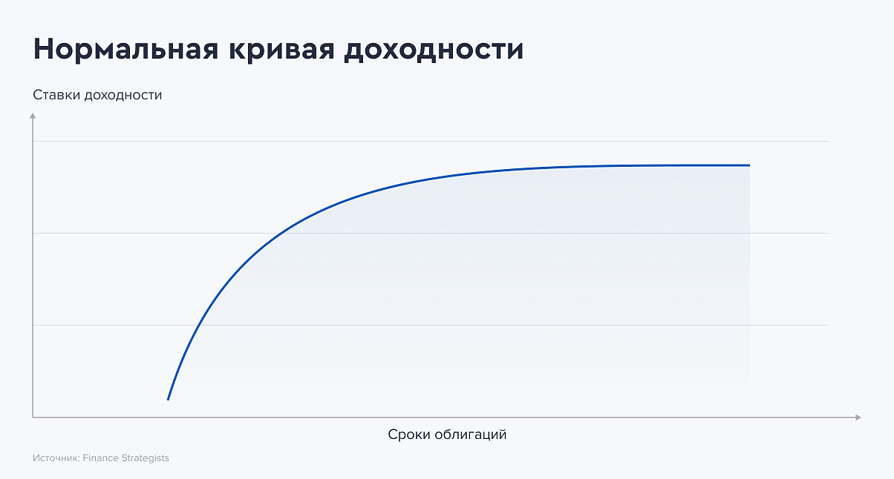
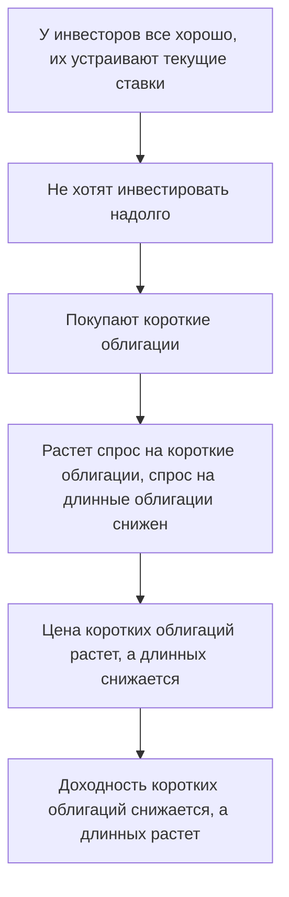
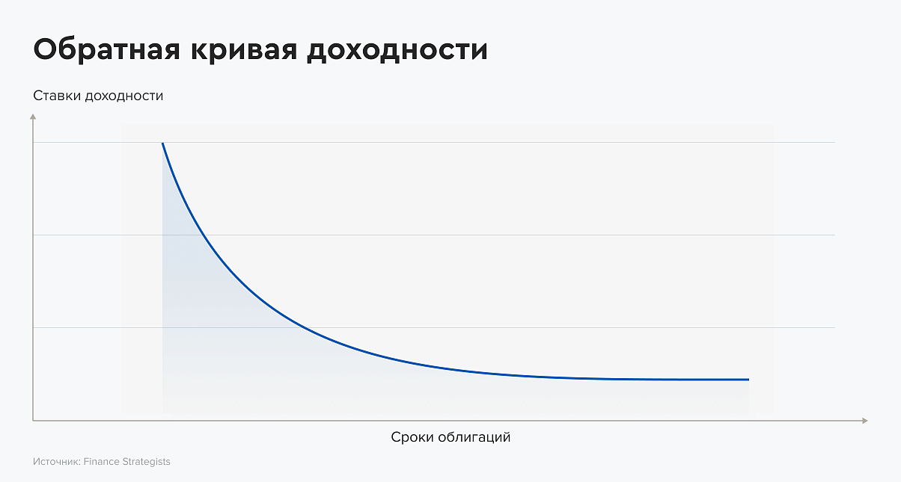
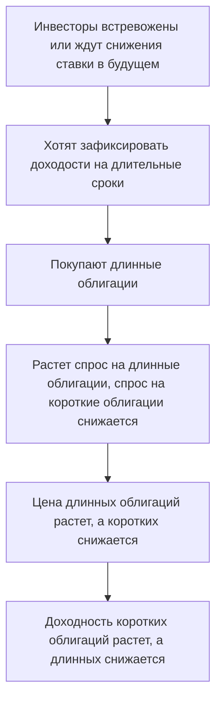
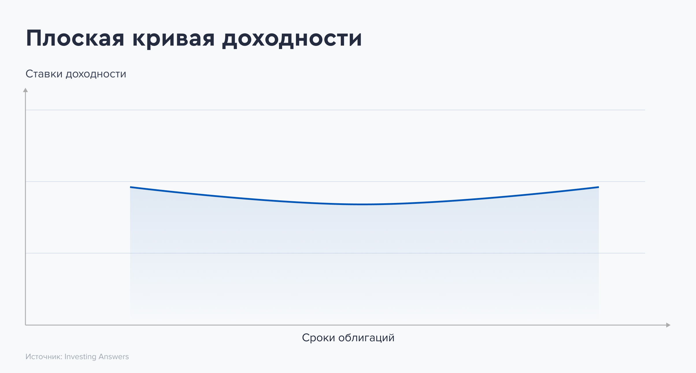

Облигации считаются менее рискованным инструментом по сравнению с акциями. Но всё же риски у них также имеются. Основной риск состоится в невыплате по долгам. Компания может перестать платить по долгам и облигациям. Инвестор рискует потерять все вложенные в облигацию деньги. Поэтому при отборе нужно анализировать не только характеристики облигации, но и эмитента. Инвестору важно понять, сможет ли компания платить проценты по облигациям и вернуть её номинал.

Фундаментальный анализ помогает ответить на эти вопросы за счет определения **финансовой устойчивости и платежеспособности эмитента**. 

>Частично тема финансовой устойчивости и платежеспособности затрагивается в главе **1.3**.

#### Net debt / EBITDA

>Показывает за сколько лет компания погасит долг за счет EBITDA при условии, что долг и прибыль не изменятся.

Если у компании этот показатель выше 3 и это не является нормой для отрасли, в которой компания работает - лучше воздержаться от добавления в свой портфель облигаций этой компании.

На рынке всегда найдутся менее рискованные компании. Не стоит гнаться за +1-2% дохода, если есть высокая вероятность потерять всё.

#### Debt / Equity (D / E)

>Показывает соотношение заёмного и собственного капитала организации. Помогает понять, насколько компания финансово независима от кредиторов и может ли она привлекать дополнительные займы.

Представим ситуацию, что выручка у компании уменьшилась из-за ситуации на рынке, и при этом ей нужно платить по процентам. Денег компании не хватает, и она решает взять кредит в банке. Так как у компании высокий коэффициент **D / E**, в кредите ей отказывают.

Вероятнее всего, теперь компании придется продавать имущество, чтобы расплатиться по долгам.

Оптимальным значением для российского рынка считается 1, когда размер долга равен размеру собственного капитала. Для развитых экономик этот показатель составляет 1.5 (60% долга и 40% собственного капитала).

#### Current Ratio

>Показывает, насколько быстро компания погасит свои краткосрочные обязательства за счет продажи наиболее ликвидных активов - оборотных.

В примере выше компании для оплаты долгов скорее всего придется продавать имущество. Коэффициент текущей ликвидности (**Current ratio**) как раз и показывает, может ли компания покрыть краткосрочные обязательства (те, что нужно погасить в течение года) за счет оборотных активов.

При показателе **равным 1 и больше** компания без проблем сможет погасить все обязательства за счет продажи оборотных активов. В этом случае инвесторы могут рассчитывать на то, что получат свои деньги назад (номинал облигации).

#### FCF

>Наличие положительного свободного денежного потока говорит о возможности компании погашать свои долги (кредиты и займы).

Если **FCF** отрицательный, то компания, как правило:

- Берет деньги на погашение долга со своих счетов;
- Берет новый долг для погашения старого;

Оба случая нежелательны, поэтому нужно обращать внимание на положительный **FCF**. Желательно наблюдать его в динамике:

- Если показатель отрицательный только в текущем периоде, а во всех других был положительный и рос - можно расценить как положительный момент;
- Если в текущем периоде показатель положительный, а в других был отрицательным - стоит не торопиться с покупкой облигации и понаблюдать за компанией;

#### ICR

>Коэффициент покрытия процентов (Interest Coverage Ratio) показывает, достаточно ли прибыли компании для погашения процентов по долгам.

Компания генерирует выручку, из которой часть денег идет на покрытие расходов себестоимости, коммерческих и административных расходов. Вычтя эти расходы из выручки, получается **операционная прибыль**. Именно из операционной прибыли компания платит проценты по взятым кредитам и займам (облигации).

>**Пример:**
>Компания взяла кредит и выпустила облигации для привлечения заёмных средств на улучшение и расширение бизнеса. Оплата по кредитам и займам составит 500 000 рублей раз в полгода.
>
>За полгода ведения бизнеса компания получила выручку 5 000 000 рублей. При этом размер коммерческих, административных расходов и расходов на себестоимость продукции составил 1 500 000 рублей.
>
>Операционная прибыль компании равна 3 500 000 рублей. Размер операционной прибыли в 7 раз больше размера процентов по кредитам и займам. Это значит, что компания справится и с этими расходами.

**Пороговое значение** коэффициента покрытия процентов 1.5. Это значит, что операционная прибыль в 1.5 раза больше размера процентов по кредитам и займам. Если у компании упадет выручка и операционная прибыль, то компания не сможет покрывать расходы по процентам за счет заработанных денег. В этом случае придется либо брать деньги в долг, либо снимать деньги со счета. Либо продавать активы для погашения задолженности по процентам.

Выбирайте компании, у которых показатель **ICR** как минимум больше 3-5.

Оценив платежеспособность эмитента по совокупности всех коэффициентов, инвестор принимает решение брать облигации компании себе в портфель или нет.

---

### Какие риски инвестирования несут облигации

Облигации считаются одним из самых консервативных инструментов рынка ценных бумаг. Рисков инвестирования в облигации намного меньше, чем в те же акции. Но все же они существуют. Инвестор должен выбирать и покупать ценные бумаги только после оценки рисков вложений в них.

**Риски инвестирования в облигации:**

- Невыплата долга и понижение кредитного рейтинга;
- Влияние высокой инфляции;
- Изменение цены облигации;
- Купоны реинвестируются под меньшую ставку;
- Изменение ставки ЦБ;
- Изменение курса валют;
- Сложности с продажей облигации;
#### Эмитент не погашает долг - кредитный риск

Иногда эмитенты не справляются с платежами и не могут вернуть свой долг инвесторам. В этом случае говорят, что произошёл дефолт. Этот риск называется кредитным. Из-за него инвестор может потерять значительную часть своих вложений.

Еще одним проявлением кредитного риска является резкое понижение кредитного рейтинга облигации или эмитента. Оно приводит к снижению цены облигаций.
#### Изменение ставки ЦБ - процентный риск

Облигации могут потерять в цене из-за изменения процентных ставок. Когда она растет, цена облигаций падает. А при снижении ключевой ставки стоимость облигаций растет. Если инвестор держит облигации до погашения, изменения цены для него неважны. Если же инвестор планирует продать ценную бумагу, то может понести убытки. Этот риск называется процентным.
#### Влияние инфляции на доход от облигаций - инфляционный риск

Доход по облигациям тоже подвергается влиянию инфляции и обесценивается. Реальную доходность можно подсчитать, если знать уровень инфляции.

$$
\text{Доходность с учетом инвляции} = \text{Доходность облигации} - \text{Инфляция}
$$

Когда инфляция высокая, то инвестор теряет часть дохода. Потому что покупательская способность денег снижается. В некоторых случаях уровень инфляции может сравняться с доходностью облигаций или даже превысить её. Наиболее подвержены этому риску дисконтные облигации и облигации с фиксированным купоном.
#### Изменение курса валют - валютный риск

Касается облигаций, выпущенных в иностранной валюте. При укреплении валюты номинала инвестор получает дополнительный доход за счет курсовых разниц. При ослаблении валюты - доходность снижается.
#### Сложности с продажей или покупкой - риск ликвидности

Рынок облигаций характеризуется меньшей ликвидностью в сравнении с другими рынками. Иногда инвестор не может быстро продать или купить облигацию по рыночной цене из-за отсутствия встречных предложений. Этот риск не касается инвесторов, которые покупают облигации и держат до их погашения.
#### Изменение цены облигаций - риск волатильности

Иногда стоимость облигаций снижается вне зависимости от процентных ставок. В этом случае инвесторы, которым нужно продать облигации могут понести потери.
#### Реинвестирование купонов под меньший процент - риск реинвестирования

Биржа рассчитывает доходность к погашению с учетом реинвестирования купонов. Это предполагает вложение полученных купонов под такую же процентную ставку, что и у выбранного выпуска. Инвестор рассчитывает на указанную доходность и покупает облигации. Однако процентные ставки могут меняться и купоны реинвестироваться будут под меньшую ставку. Это уменьшает итоговую доходность инвестора.
#### Покупка облигаций с непонятным принципом работы - инвестиционный риск

Часто инвестор покупает облигации, принципов работы и рисков которых не понимает. Сюда можно отнести инвестиционные облигации, которые обещают высокий доход, но только при наступлении ряда условий.

>**Важно!** Перечисленные риски не связаны с каждым выпуском облигаций. Это общий список рисков, с которыми могут столкнуться инвесторы.

---

### Как уменьшить риски инвестирования в облигации

#### Выбирать облигации надежных эмитентов

Облигации требуют анализа и качественного отбора для снижения риска невыплат по долгу. При выборе инвестору нужно изучить эмитента - платёжеспособность, перспективы и т.д. Важно познакомиться с кредитными рейтингами как эмитента, так и облигации
#### Обращать внимание на объемы торгов

При выборе облигаций важно учитывать их ликвидность. Небольшие объемы торгов могут быть причиной срабатывания риска ликвидности.
#### Держать облигации до погашения

Инвесторы, которые держат облигации до погашения, не переживают из-за изменения их цен. Если вы не готовы рассматривать даже возможность продажи облигации ниже цены её покупки, подбирайте выпуски с погашением в нужный вам период.
#### Диверсифицировать портфель облигаций

Для снижения рисков желательно диверсифицировать облигации по:

- Эмитенту - рассмотреть разных эмитентов, число которых будет зависеть от объема облигаций в портфеле;
- Сроку - комбинировать облигации с разным сроком до погашения;

Не стоит концентрироваться на 1-2 выпусках облигаций и эмитентах потому что в случае дефолта по одному из выпусков инвестор потеряет значительную часть капитала. Однако излишней диверсификации также лучше избегать из-за необходимости отслеживания новостей и показателей эмитентов.
#### Знать, что покупаешь

Перед покупкой инвестор должен изучить все характеристики и принципы работы облигации. Такой подход поможет избежать ему *сюрпризов* в виде неожиданной оферты, амортизации или особых условий получения дохода.

---

### Что такое кривая доходности облигаций

Если доходность облигаций в процентах перенести на график, то мы получим кривую доходности.

>**Кривая доходности облигаций** - графическое изображение доходности облигаций одного эмитента в зависимости от срока их погашения. Она не учитывает купонные выплаты, поэтому называется бескупонной.

Кривая доходности может быть:

- Нормальная или классическая;
- Перевернутая или инверсная;
- Горизонтальная или плоская;

При построении кривой доходности используются государственные облигации, учитывается доходность облигаций с разным сроком погашения. Кривая показывает, по облигациям с каким сроком погашения доходность выше и ниже.

Характерна для благоприятных периодов экономики и периода повышения ключевой ставки. Доходность облигаций растет по мере увеличения срока до погашения, потому что они более рисковые. Инвесторы больше покупают короткие облигации.

Таким график бывает в период экономических кризисов, потрясений и в период понижения ключевой ставки.

Встревоженные инвесторы стараются зафиксировать доходности облигаций на долгих срок и покупают длинные облигации.

Горизонтальный вид график принимает в переходные периоды, когда ожидания инвесторов на короткий и длинный промежутки времени выравниваются. Поэтому и доходности находятся примерно на одинаковом уровне.

Переход от одного вида кривой доходности к другому может являться признаком изменений ситуации в экономики. График отражает ожидания рынка относительно кризиса, инфляции и т. п. Однако на него могут влиять и действия ЦБ. В сложные периоды регуляторы выкупают конкретные государственные облигации с рынков, что отражается на цене и кривой доходности.

>Увидеть график бескупонной доходности отечественных ОФЗ можно на сайте Центрального Банка России.

