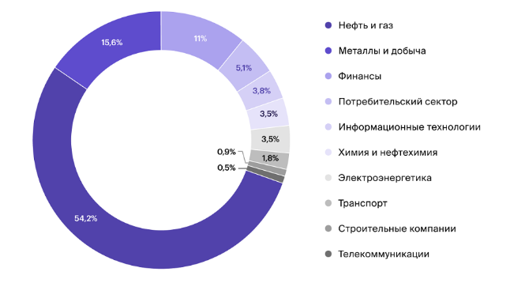
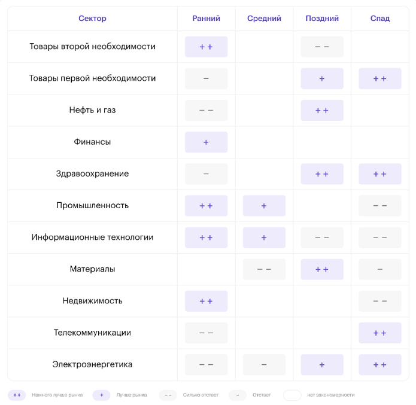

**Секторальный анализ** ‒ это оценка текущего финансового и экономического состояния, а также перспектив определенного сектора. Он помогает инвестору определить, насколько эффективно будут работать компании конкретной отрасли.

Об Секторальном анализе можно сказать следующее:
1. Он используется инвесторами для оценки перспектив каждого отдельного сектора.
2. Считается, что конкретные отрасли показывают наибольшую эффективность на определенных этапах бизнес-цикла. Учитывая эту закономерность, можно выявить самые подходящие для инвестирования акции.
3. Метод секторального анализа «сверху вниз» акцентирует внимание на макроэкономических показателях, влияющих на экономику, включая уровень безработицы, инфляции.
4. Ротация используется инвесторами для перевода капитала из одной отрасли в другую в зависимости от рыночных циклов и существующих тенденций, влияющих на потенциальную доходность разных секторов.

---
### Принцип работы секторального анализа

Секторальный анализ базируется на теории о том, что эффективность предприятий напрямую зависит от их отраслевой принадлежности и текущей фазы экономического цикла. Разные сектора показывают наилучшие результаты на разных этапах этого цикла.

**Фазы экономического цикла**

Выделяют три основных периода экономической активности: возрождение, экспансия и спад. В более детальной классификации этапы делятся на ранний, средний, поздний и рецессию. Каждый из них может длиться несколько лет. В зависимости от конкретного этапа наибольшую актуальность для инвесторов приобретают циклические либо защитные активы.

**Ранний этап цикла (возрождение)**

На начальной стадии делового цикла процентные ставки, как правило, находятся на низком уровне, а экономика начинает ускоряться. В этот период инвесторы отдают предпочтение ценным бумагам эмитентов, которые выигрывают от дешевизны кредитов и роста объемов кредитования. К числу таких фаворитов относятся компании финансового и потребительского секторов.

**Поздний этап и спад**

На поздних стадиях цикла темпы экономического роста замедляются. В этих условиях инвесторы склонны вкладывать средства в акции компаний, предоставляющих коммунальные и коммуникационные услуги. Подобные предприятия, как правило, демонстрируют наиболее устойчивые показатели в периоды экономических спадов.

---
### Методы секторального анализа

Самыми популярными видами отраслевого анализа являются нисходящий подход и метод ротации секторов.

**Нисходящий подход**

Инвесторы, применяющие нисходящий подход, в первую очередь обращают внимание на самые важные макроэкономические показатели, которые оказывают максимальное влияние на благосостояние основной части населения и на состояние экономики в целом. Это прежде всего уровень безработицы, инфляция, объемы производства.

Затем проводится более углубленный анализ, позволяющий определить отрасли, которые способны эффективнее других работать в определенных условиях экономики в среднесрочной или долгосрочной перспективе. На последнем этапе оцениваются фундаментальные показатели компаний этих отраслей. Таким образом удается выбрать самые перспективные акции для получения максимальной прибыли.

>_**Справка.**_ *Противоположным этому методу является анализ «снизу вверх». Сначала производится отбор акций, а затем принимается решение с учетом макроэкономических показателей и рыночных условий.*

**Ротация секторов**

Инвесторы применяют метод секторального анализа для ротации инвестиций в разные отрасли экономики. Производится ребалансировка портфеля. Инвестор покупает активы одной отрасли и продает ценные бумаги другой, ориентируясь на рыночные циклы и последние тенденции, оказывающие влияние на показатели прибыльности одних секторов по сравнению с другими.

Рыночные циклы могут зависеть от сезонности. Например, в сезон новогодних праздников рекомендуется вкладывать средства в отрасль розничной торговли. Мера направлена на получение прибыли от увеличения объемов продаж потребительских товаров.

> _**Внимание!**_ _Инвестор может покупать и продавать циклические или защитные активы в зависимости от того, на каком этапе цикла находится экономика._

---
### Схема экономического цикла

В деталях схема экономического цикла выглядит следующим образом:
1. **Ранний этап ‒ выход экономики из состояния кризиса.** В это время инфляция имеет низкий уровень, а ВВП демонстрирует рост. На этом этапе рекомендуется приобретать циклические акции. Это активы производителей товаров вторичной необходимости, промышленного сегмента, информационных технологий.
2. **Средний этап ‒ рост экономики.** Инфляция характеризуется умеренными показателями. К концу этого периода, как правило, повышается ключевая ставка. Положительную динамику демонстрируют компании промышленной и технологической отраслей.
3. **Поздний этап ‒ рост инфляции.** В таких условиях повышаются цены на сырье. Растут котировки нефти и газа, эффективно работают предприятия металлургической промышленности. Не рекомендуется вкладывать средства в циклические акции. В связи с ростом ставок на ипотеку сфера недвижимости тоже может оказаться невыгодной для инвестиций. Сокращается разница между доходностью дивидендных акций и государственных облигаций. Первые утрачивают свою привлекательность.
4. **Рецессия.** О наступлении этого периода можно говорить, если снижение уровня ВВП продолжается в течение двух кварталов и более. В это время рекомендуется инвестировать в защитные активы, включая ценные бумаги отрасли здравоохранения. Продукция предприятий этих секторов востребована даже в периоды кризиса. На этапе рецессии Центральный банк принимает меры по стимулированию экономики. С их помощью удается преодолеть сложности, после чего начинается новый цикл.

---
### Секторы экономики

На российском рынке принято различать 10 секторов экономики. Около 45% капитализации принадлежат предприятиям нефтегазовой отрасли, 20% ‒ учреждениям сферы финансов: [[Нефть и газ]], [[Металлы и добыча]], [Финансы](Финансовый%20сектор.md), [[Потребительский сектор]], [[Информационные технологии]], [[Химия и нефтехимия]], [[Электроэнергетика]], [[Транспорт]], [Строительные компании](Строительный%20сектор.md), [[Телекоммуникации]], 

Ниже представлена диаграмма, на которой показана зависимость поведения акций от бизнес-циклов.

